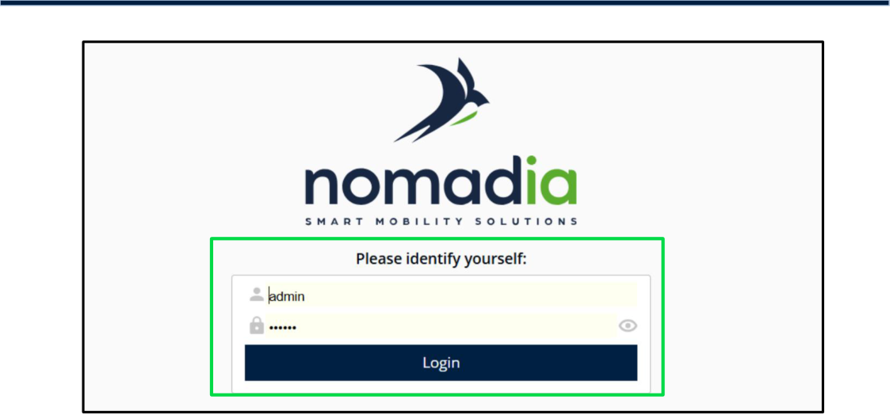
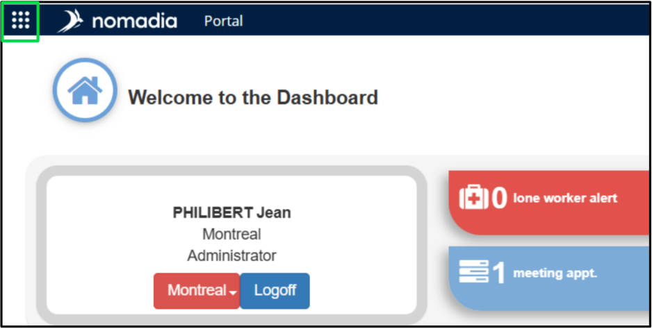
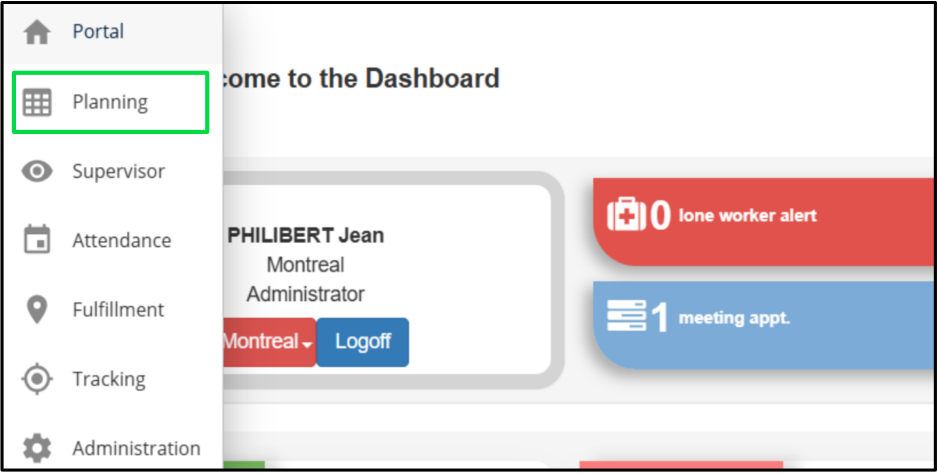

# Nomadia Field Service

## **1. Introduction** 

### **1.1. Purpose of this Guide** 

This guide is designed to provide you with a comprehensive understanding of the **Nomadia Field Service (NFS) Planning Module** . It outlines the steps to navigate, configure, and efficiently use the module to manage **tasks** , **resources** , **schedules** , and **customer data** . By the end of this guide, you will be equipped to: 

1. Optimize task allocation and scheduling. 

2. Customize views and manage resources. 

3. Enhance operational efficiency through advanced planning tools. This document aims to ensure that users can maximize the module’s potential to improve workflow and decision-making. 

### **1.2. Scope** 

The scope of this guide includes: 

- Detailed instructions on using the Planning Module features. 

- Guidance on configuring customizable views and managing notifications. 

- Step-by-step procedures for resource and appointment management. 

- Integration of mapping and routing tools to enhance geographic planning. 

- FAQ and Glossary sections to address common queries and terminologies. This guide does not cover installation processes or integration with third-party software, focusing exclusively on the operational aspects of the Planning Module. 

### **1.3. Getting Started** 

###### **1. Accessing the Module:** 

Log in to the **Nomadia Field Service application** with your credentials. 

**Confidential** 

**NFS – Planning Module User Guide** 

Page **5** of **76** 

Click the **Square Dots** in the top-left corner and select the " **Planning Module** ” from the menu. 

**Confidential** 

**NFS – Planning Module User Guide** 

Page **6** of **76** 

###### **2. Basic Navigation:** 

Familiarize yourself with the **dashboard** , which provides an overview of 

###### **tasks, resources** , and **schedules** . 

Explore key features such as **task assignment, agenda customization** , and 

###### **map integration** . 

###### **3. Pre-Requisites:** 

Ensure you have administrative rights for specific actions like assigning resources or configuring notifications. 

Validate customer and resource details for seamless planning. 

###### **4. Training** : 

Refer to the walk-through videos and tutorials provided in the application to quickly 

adapt to the module. 

**Confidential** 

**NFS – Planning Module User Guide** 

Page **7** of **76** 

