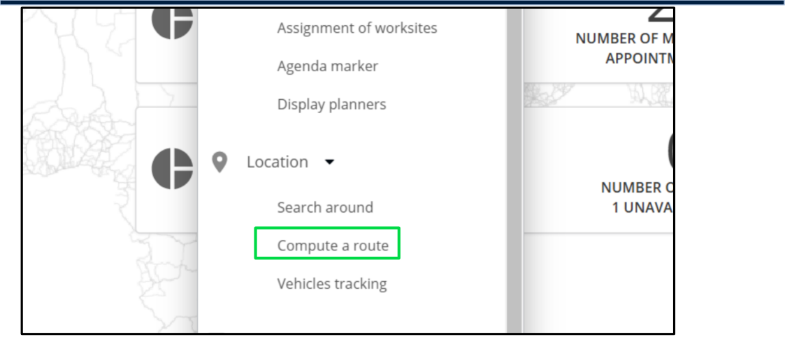
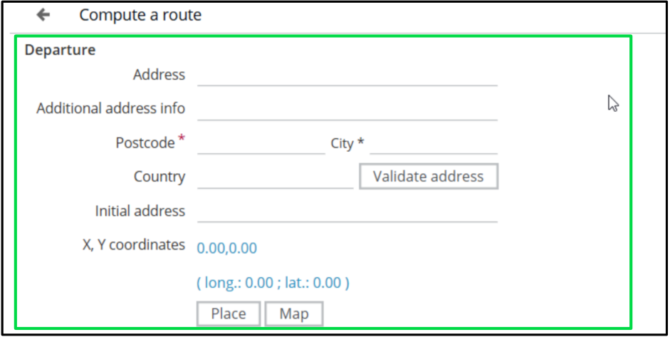
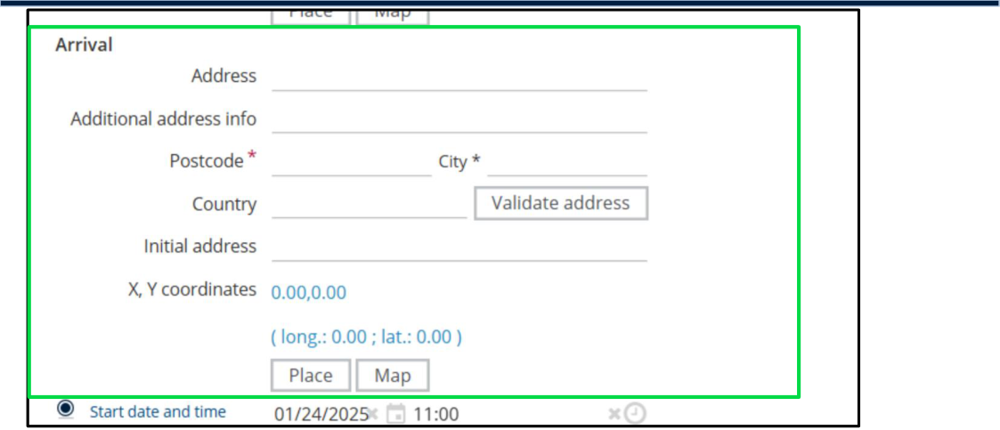
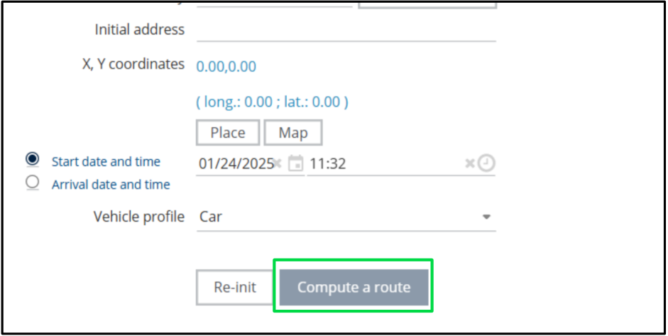

# Nomadia Field Service

## **10. Manage Route** 

The Manage Route feature in Nomadia Field Service helps plan and optimize travel routes for field operations. By entering departure and arrival details, you can validate addresses, find the best routes, and ensure timely, cost-effective journeys. 

|**Feature**|**Description**|
|---|---|
|Enter Location|nput departure and arrival details.|
|Optimize Route|Calculate the most efficient travel path.|
|Validate Address|nsure addresses are accurate and reachable|
|Estimate Travel Time|Get real-time journey duration estimates.|

### **10.1. Computing a Route** 

1. Click on **Planning** in the menu. 

2. Open the **Location** Dropdown list 

3. Select **Compute a route** . 

**Confidential** 

**NFS – Planning Module User Guide** 

Page **72** of **76** 

4. Enter the following details: 

   - 1) **Postal Code** and **City** for the Departure. 

###### • **Postal Code** and **City** for the Arrival. 

###### 5. Click **Validate Address** 

**Confidential** 

**NFS – Planning Module User Guide** 

Page **73** of **76** 

###### 6. Click **Compute a Route** 

**Confidential** 

**NFS – Planning Module User Guide** 

Page **74** of **76** 

