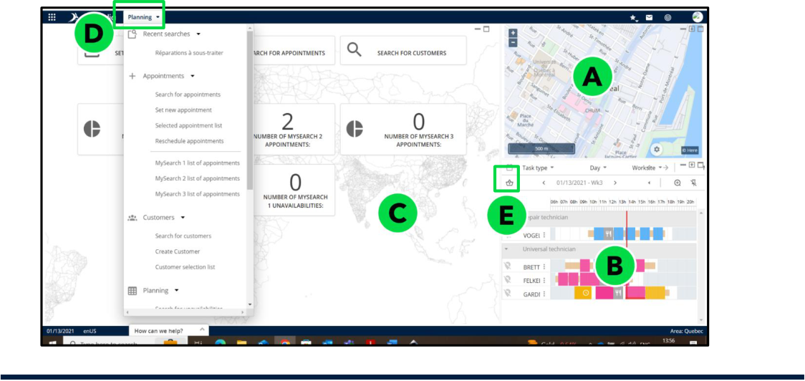

# Nomadia Field Service

## **2. Overview of the Planning Module** 

The **Planning Module** is a fundamental feature designed to simplify and enhance the management of tasks, resources, and schedules. It allows managers to efficiently create, modify, and oversee task assignments for field technicians, ensuring optimal use of time and resources. 

###### **Key functionalities include:** 

- ✓ Drag-and-Drop Task Assignment: Quickly assign tasks with an intuitive interface. 

- ✓ Real-Time Updates: Ensure schedules and task statuses are always up to date. 

- ✓ Visual Indicators: Easily monitor technician availability and workload. 

Integration with mapping and routing tools enables geographic optimization, helping to minimize travel time and reduce operational costs. Configurable views and filters provide tailored insights, empowering managers to make informed decisions and streamline workflows to meet business objectives. 

### **2.1. What is it?** 

The Planning Module interface is organized into three distinct sections, each offering unique functionality to enhance planning and scheduling efficiency. 

**NFS – Planning Module User Guide** 

**Confidential** 

Page **8** of **76** 

###### **A. Map View** : 

   - Enables users to locate customers. 

   - Displays routes and tracks road traffic in real-time, providing essential information for planning efficient field operations. 

- This interactive view enables you to showcase schedules and easily spot 

- available time slots. 

###### **B. Planning View** : 

- Displays the schedules of various technicians in an organized format. 

- Allows easy identification of availability, conflicts, or workload distribution. 

###### **C. Wallpaper View** : 

- Offers shortcuts for quick access to frequently used searches and tools, ensuring seamless navigation within the module. 

###### **D. Planning Menu:** 

- Provides a range of functionalities and features designed to streamline scheduling, task assignments, and resource management, enhancing overall planning efficiency within the module. 

###### **E. Appointment Panel** 

- Provides a detailed view of scheduled tasks, allowing users to manage, reschedule, or update appointments efficiently. It displays key information such as appointment time, location, assigned technician, and status. Users can interact with the panel to modify assignments, add notes, or track real-time updates 

### **2.2. Who is it for?** 

This module is designed as the primary workspace for planners. It provides all the necessary tools to allocate tasks, manage schedules, and optimize operations effectively. 

**Confidential** 

**NFS – Planning Module User Guide** 

Page **9** of **76** 

