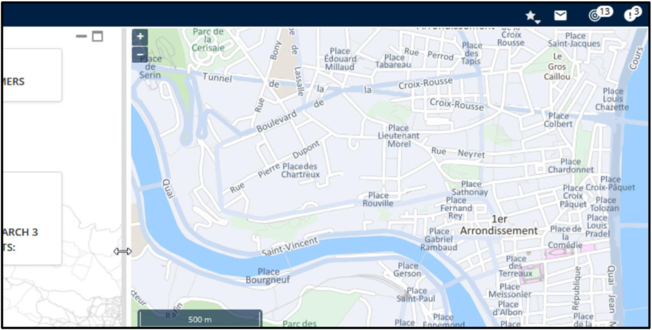
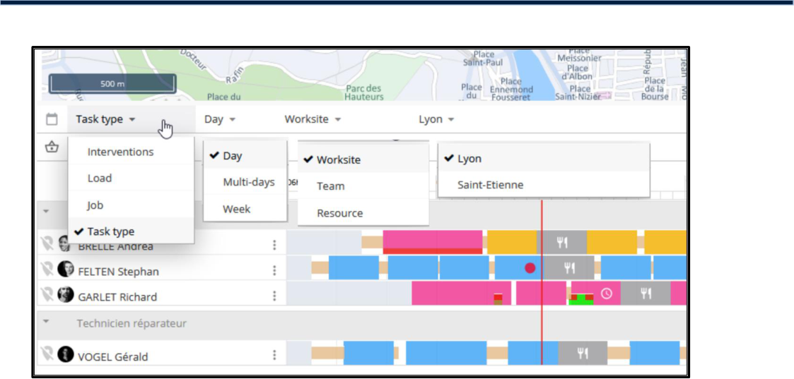
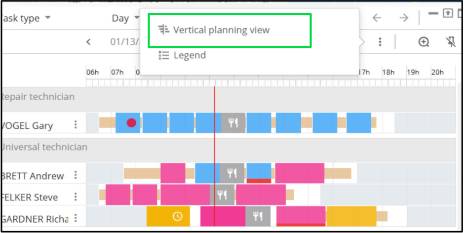
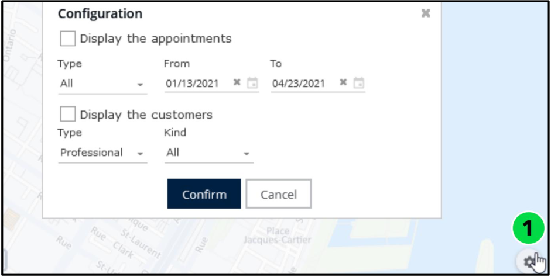

# Nomadia Field Service

## **3. Customize Views** 

**Customizable Views** empower you to tailor your workspace by adjusting layouts, filters, and displaying information to suit specific roles or tasks. This feature ensures that only the most relevant data is visible, minimizing distractions and enhancing productivity. 

|**Feature**|**Description**|
|---|---|
|Layout Adjustments|Resize panels, rearrange widgets, or choose which columns to display|
|Filtering and Sorting|Apply filters to focus on specific data and sort information based on criteria such as time, priority, or location|
|Preference Saving|Save customized layouts for future sessions, ensuring consistency and convenience.|

### **3.1. Resize Windows** 

- Select the window you want to resize. 

- Move the cursor to the window’s edge. 

- Click and hold the edge of the window. 

- Drag it to adjust the size as needed. 

**Confidential** 

**NFS – Planning Module User Guide** 

Page **10** of **76** 

### **3.2. Customize Planning Views** 

You can personalize the agenda display to fit your specific needs. Configure how tasks, appointments, or schedules are presented by selecting filters or grouping criteria that best suit your workflow. efficiency. 

#### **3.2.1. Filter the Planning** 

|**Filters Items**|**Filters Values**|**Description**|
|---|---|---|
|Main Criterion|Interventions|Filters appointments based on their status (e.g., completed, pending, canceled).|
|Load|Workload in percentage.|Displays the percentage of workload assigned to each resource or team.|
|Job|Types of job assigned to technician|Filters tasks by specific job types, such as maintenance or installation.|
|Task Type|Types of Tasks assigned to technicians|Categorize tasks based on their type, like urgent, routine, or scheduled.|
|Time Frame|Day, Multi-days, Week.|Allows viewing tasks over different timeframes, such as a single day, multiple days, or an entire week.|
|Group|Worksite, Team, Resource|Groups tasks by worksite location, team assignment, or individual resources.|

**Confidential** 

**NFS – Planning Module User Guide** 

Page **11** of **76** 

#### **3.2.2. Set the Planning View** 

###### From the **Planning View** 

1. Move the cursor over the triangle icon. 

2. Click the three-dots icon. 

3. Select the preferred view. 

**Confidential** 

**NFS – Planning Module User Guide** 

Page **12** of **76** 

### **3.3. Customize the Map View** 

You can visualize the locations of appointments or customers on the map by applying relevant filters. 

|**Filter**|**Applies to**|**Examples**|
|---|---|---|
|Type|Both|Professional, Retail, or Installation, Maintenance|
|Timeslot (From, To)|Appointments|From 01/13/2024 to 01/14/2024|
|Kind|Highlights critical alerts that require immediate attention, helping you stay on top of urgent matters.|Casual, Premium|

From the **Map View** , 

1. Click on the **Settings icon** . 

2. Choose **Display the appointments** , **Display the customers** , or **Both** . 

3. Apply the **Desired Filters** . 

4. Click **Confirm** 

**NFS – Planning Module User Guide** 

**Confidential** 

Page **13** of **76** 

