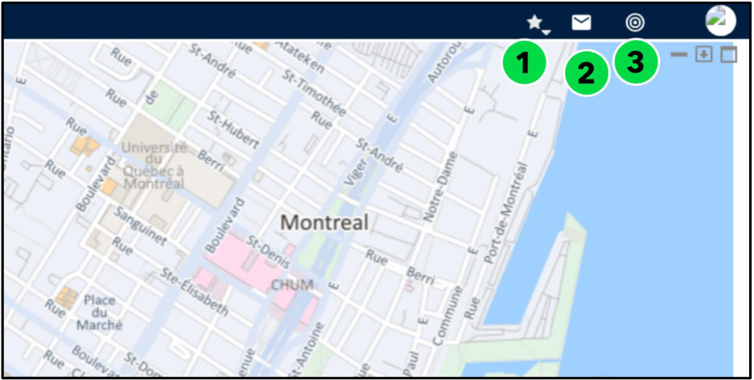

# Nomadia Field Service

## **4. Manage Notifications** 

The notification banner with three icons is positioned in the upper-right corner of the application. 

|**Icon**|**Feature**|**Description**|
|---|---|---|
|1|Recently Viewed Tab|Displays recently viewed notifications,|
|2|Unread Messages Tab|Displays all unread notifications,|
|3|Alerts Tab|Highlights critical alerts that require immediate attention.|

1. Select the **Recently Viewed Tab** to review messages you’ve already opened. 

2. Navigate to the **Unread Messages** section to see any new or unopened notifications. 

3. Go to the **Alerts Tab** to view important system alerts or critical updates 

**Confidential** 

**NFS – Planning Module User Guide** 

Page **14** of **76** 

