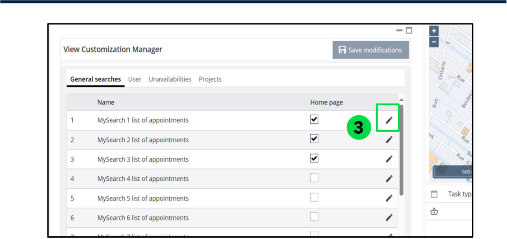
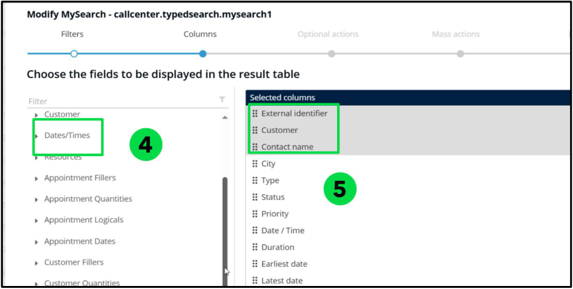
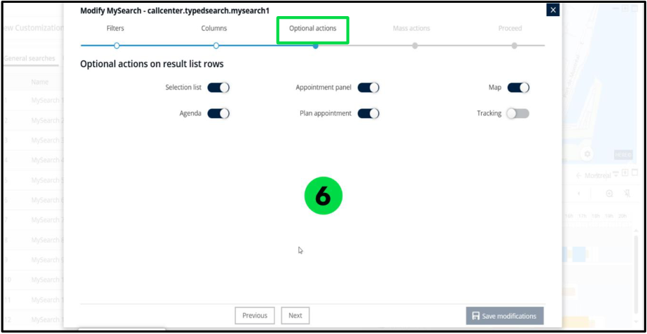
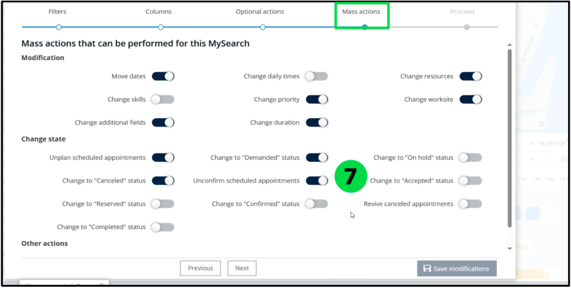
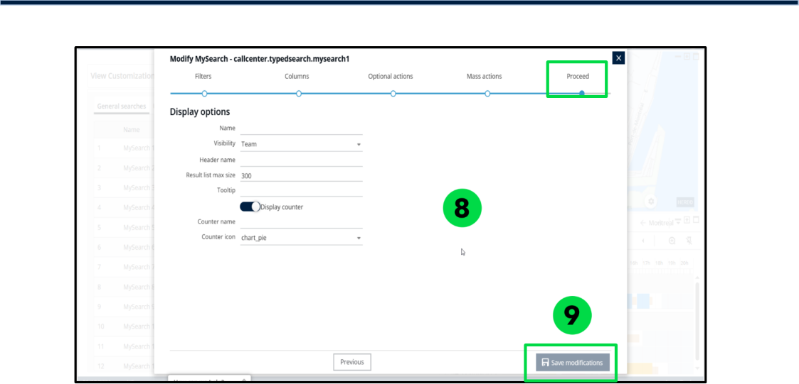
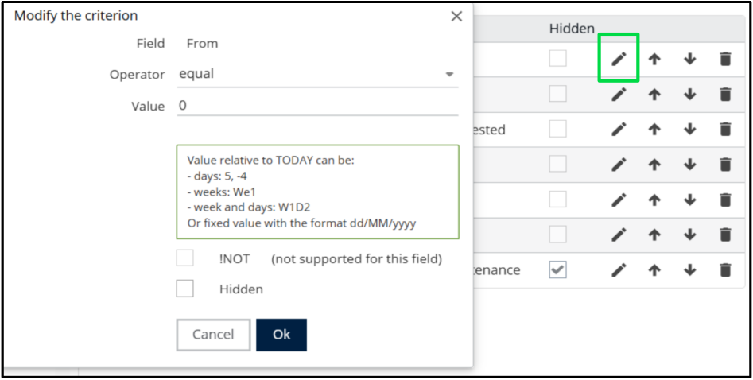
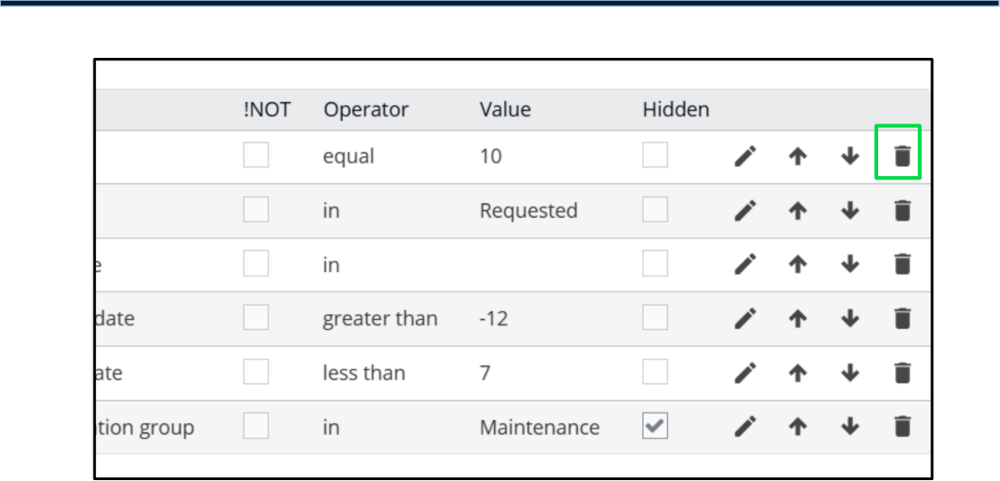

# Nomadia Field Service

## **5. Manage Searches** 

- Available Filters and Columns 

|**My Search Category**|**Filters and Columns Themes**|
|---|---|
|Appointments, Appointment Alerts and Users|Identifiers, Address, Appointment, Customer, Dates/Times, Resources, Appointment Fillers, Appointment Quantities, Appointment Logicals, Appointment Dates, Customer Fillers, Appointment Detail Fillers, Appointment Detail Quantities, Appointment Detail Logicals, Appointment Detail Dates, Other|
|Unavailabilities|Identifiers, Unavailability, Address, Dates/Times, Unavailability Fillers, Unavailability Quantities, Unavailability Logicals, Unavailability Dates|
|Projects|Identifiers, Project, Customer, Dates/Times, Project Fillers, Project Quantities, Project Logicals, Project Dates|
|Optional actions avail **My Search Category**|able for My Search **Optional Actions**|
|Appointments, Appointment Alerts and Users|Selection list, Agenda, Appointment panel, Plan appointment, Map, Tracking Appointment Detail Quantities, Appointment Detail Logicals, Appointment Detail Dates, Other|

- Optional actions available for My Search 

**Confidential** 

**NFS – Planning Module User Guide** 

Page **15** of **76** 

- Available mass actions 

|**My Search**|**Optional mass action’s theme**|**Optional mass actions**|
|---|---|---|
|Appointments Appointment alerts Users|Modification|Move dates, change skills, change additional fields, change daily times, change priority, change duration, change resources, Change worksite|
|Appointments Appointment alerts Users|Change state|Unplan scheduled appointments, change to “Canceled” status, change to “Reserved” status, change to “Completed” status, change to “Demanded” status, Unconfirm scheduled appointments, change to “Confirmed” status, change to “On hold” status, change to “Accepted” status, Revise canceled appointments|
|Appointments Appointment alerts Users|Other actions|Plan, Subcontractor, Announce|

### **5.1. Create a My Search** 

1. Click on **Planning** menu 

###### 2. Click **View customization manager** 

3. Click the **Pen** icon on the chosen template for Appointments or Appointment Alerts. 

**Note** : To create a My Search for Users, Unavailabilities, or Projects, click the 

respective tab. 

**Confidential** 

**NFS – Planning Module User Guide** 

Page **16** of **76** 

4. Select the **filters** for your search. (Default filters are pre-selected.) 

5. Click on the **Columns** tab. 

   - Select the fields to display and reorder them if needed 

###### 6. Click **Optional Actions** . 

- Enable or disable actions to display on result list 

**Confidential** 

**NFS – Planning Module User Guide** 

Page **17** of **76** 

###### 7. Click **Mass Actions** 

- Enable or disable mass actions that can be performed 

8. Click **Proceed** to display the options 

   - Populate the fields 

###### 9. Click **Save Modifications** . 

**Confidential** 

**NFS – Planning Module User Guide** 

Page **18** of **76** 

### **5.2. Edit My Search** 

**Note** : Some filters are automatically pre-selected when configuring a My Search. You 

can modify or remove these filters as needed. 

1. Click on **Planning** menu 

2. Click **View customization manager** 

3. Click the **Pen** icon on the chosen template for Appointments or Appointment 

   - Alerts. 

4. Click the following icon to edit the criterion. 

**Confidential** 

**NFS – Planning Module User Guide** 

Page **19** of **76** 

### **5.3. Delete My Search** 

1. Click on **Planning menu** 

###### 2. Click **View customization manager** 

3. Click the **Pen** icon on the chosen template for Appointments or Appointment 

   - Alerts. 

4. Click the designated icon to delete the My Search 

**Confidential** 

**NFS – Planning Module User Guide** 

Page **20** of **76** 

