# Nomadia Field Service

## **6. Manage Resources** 

The Manage Resources feature optimizes resource allocation by efficiently assigning and tracking personnel, vehicles, and equipment. It ensures smooth operations by managing availability and handling unavailability periods effectively. 

|**Feature**|**Description**|
|---|---|
|Personnel|Assign tasks to field personnel based on their|
|Management|availability and skill set.|
|Vehicle Allocation|Allocate vehicles efficiently for scheduled tasks and monitor their usage.|
|Equipment Tracking|Track the availability and use of essential tools and equipment.|
|Unavailability|Manage periods of unavailability to prevent|
|Handling|scheduling conflicts.|

### **6.1. Assign a Sector to a Resource** 

###### 1. Click on **Planning** Menu. 

**Confidential** 

**NFS – Planning Module User Guide** 

Page **21** of **76** 

2. Open the **Planning** Dropdown List. 

###### 3. Click on **Assignment of Worksites** . 

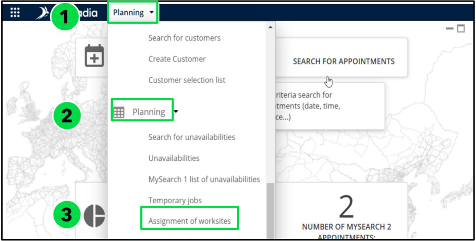

###### 4. Select a **Mobile Resource** . 

5. Choose a **Sector** . 

6. Specify the **From** and **To** Dates. 

7. Click **Assign a Sector** . 

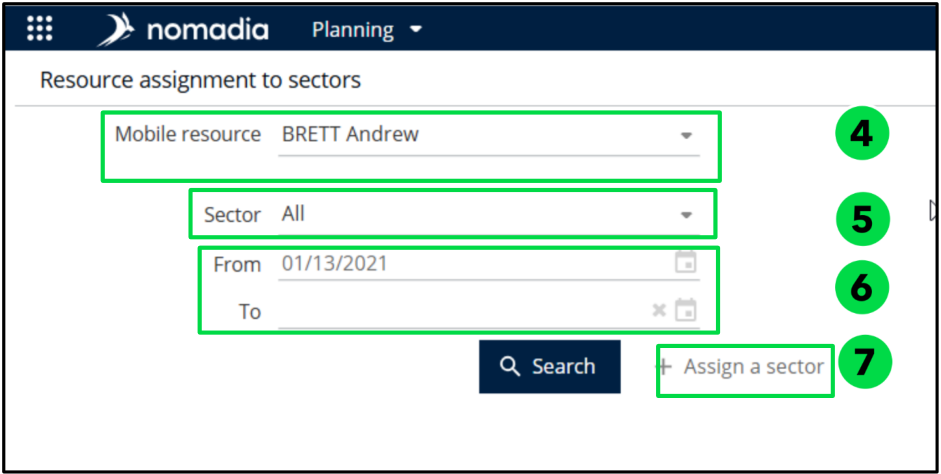

**NFS – Planning Module User Guide** 

**Confidential** 

Page **22** of **76** 

###### 8. Click **Save** . 

### **6.2. Add a Job to a Resource** 

Temporary Jobs refer to short-term or ad hoc assignments that are not part of the standard planning schedule. These jobs are typically created to address urgent tasks, last-minute requests, or temporary work that does not follow a predefined workflow. Users can access Temporary Jobs through the Planning Menu, where they can view, assign, and manage these tasks efficiently. Unlike regular jobs, which are planned, temporary jobs allow for quick adaptability to operational needs. 

1. Click on **Planning** Menu. 

2. Open the **Planning** Dropdown List. 

3. Click on **Temporary Jobs** 

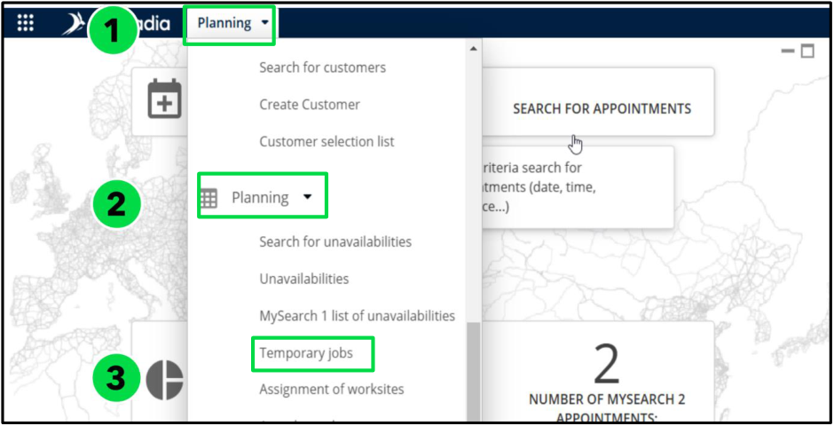

4. Enter the required details: 

   **1. Mobile Resources** 

   **2. Job** 

   **3. From** and **to** dates 

5. Click **Add a Job.** 

**Confidential** 

**NFS – Planning Module User Guide** 

Page **23** of **76** 

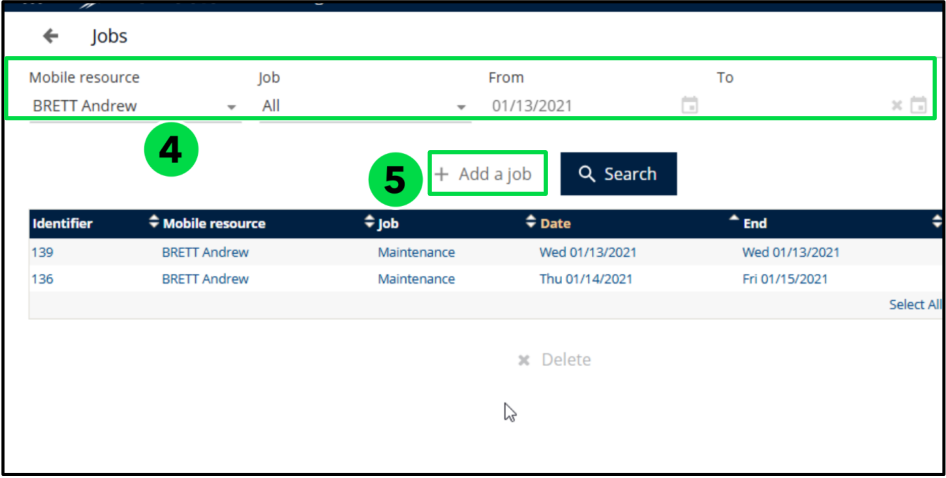

###### 6. Enter the **Address** 

7. Click **Validate** 

8. Click **Save** 

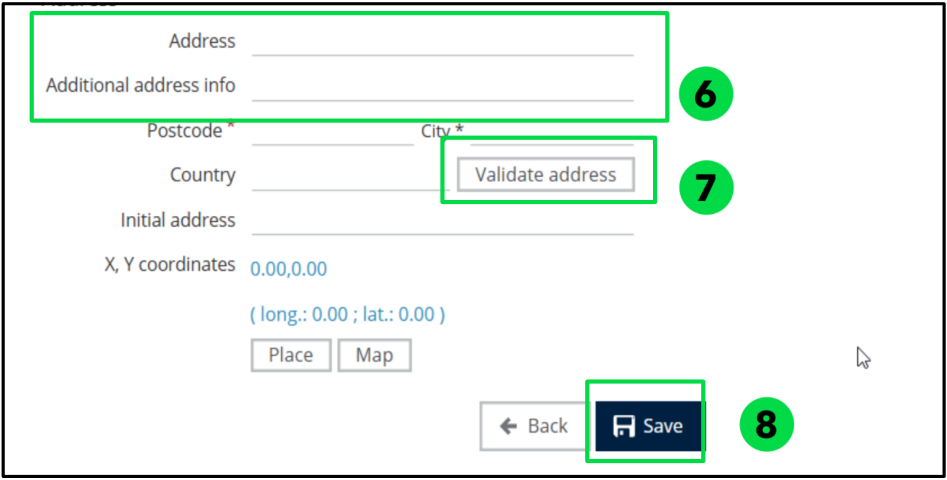

### **6.3. Manage the unavailability** 

The Manage Unavailability feature allows for effective planning and tracking of resource unavailability periods, ensuring seamless scheduling and minimal disruptions. 

**Confidential** 

**NFS – Planning Module User Guide** 

Page **24** of **76** 

#### **6.3.1. Search an Unavailability** 

1. Click on **Planning** in the menu. 

2. Open the **Planning** Dropdown list 

3. Click on **Search for Unavailabilities** 

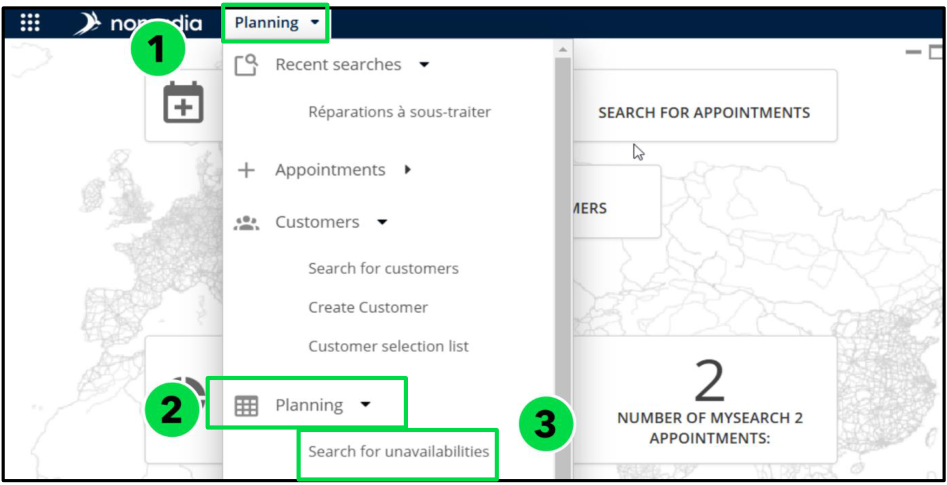

4. Enter the following details: 

   - ✓ **Address** 

   - ✓ **Postal Code** 

   - ✓ **City** 

5. Click **Find** 

**Confidential** 

**NFS – Planning Module User Guide** 

Page **25** of **76** 

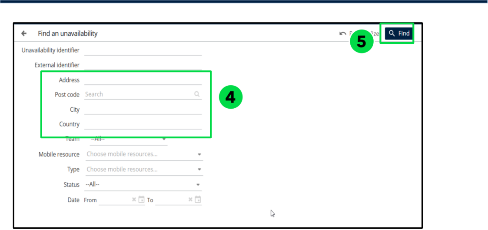

#### **6.3.2. Add an Unavailability** 

1. Click on **Planning** in the menu. 

2. Open the **Planning** Dropdown list 

3. Click on **Unavailabilities** 

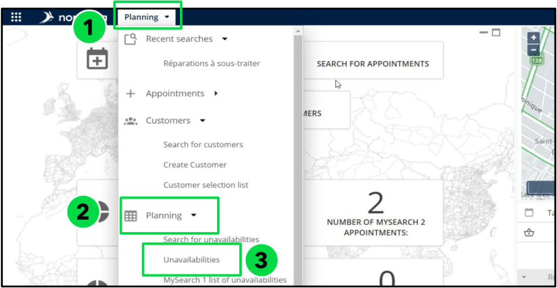

**NFS – Planning Module User Guide** 

**Confidential** 

Page **26** of **76** 

4. Fill in the required details: 

   1. **Type** 

   2. **Mobile Resources** 

   3. **Duration** 

   4. **Frequency** 

   5. **Address** 

###### 5. Click **Add Unavailability** 

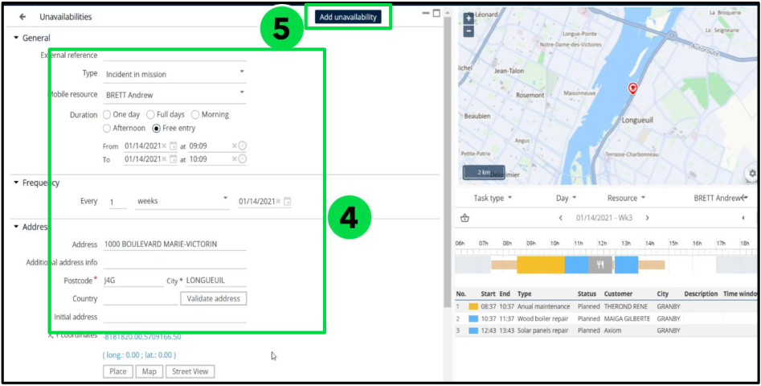

#### **6.3.3. Edit Unavailability** 

- ✓ Click on **Planning** in the menu. 

- ✓ Open the **Planning** Dropdown list 

- ✓ Click on **Unavailabilities** . 

- ✓ Select the **Desired Unavailability** from the list 

**Confidential** 

**NFS – Planning Module User Guide** 

Page **27** of **76** 

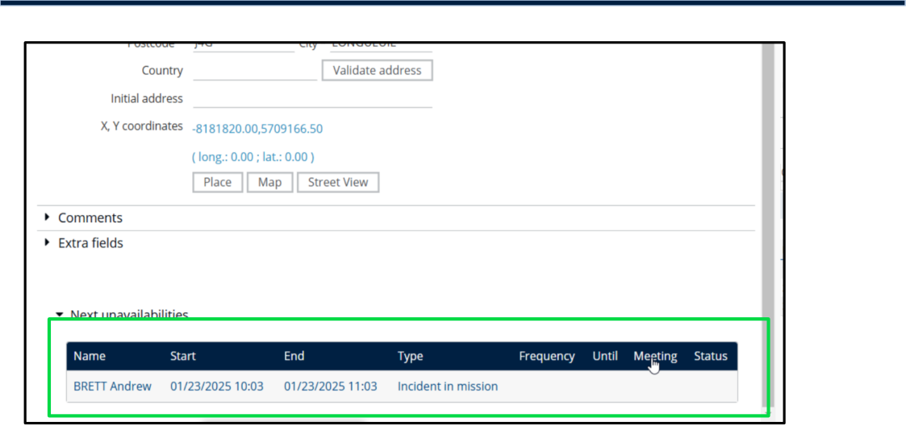

- ✓ Click **Modify** to edit the details. 

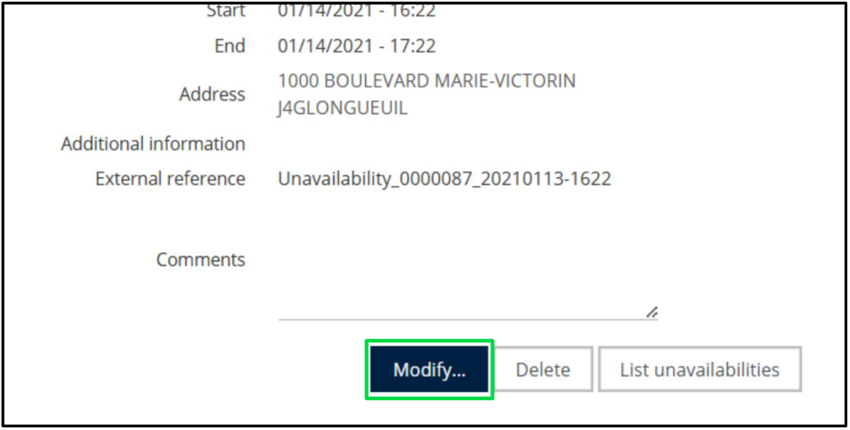

###### ✓ Make the **Necessary Changes** . 

- ✓ Click **Apply** 

**Confidential** 

**NFS – Planning Module User Guide** 

Page **28** of **76** 

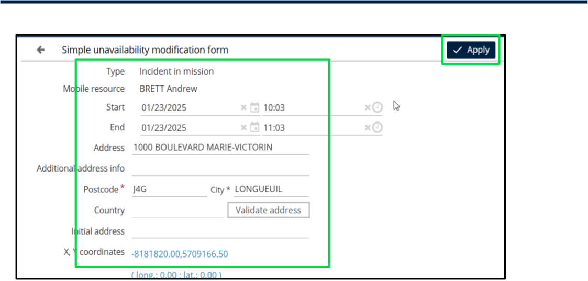

#### **6.3.4. Delete an Unavailability** 

- Click on **Planning** in the menu. 

- Open the **Planning** Dropdown list 

- Click on **Unavailabilities** . 

- Select the **Desired Unavailability** from the list 

- Click the **Delete button** next to the Modify tab to remove the unavailability. 

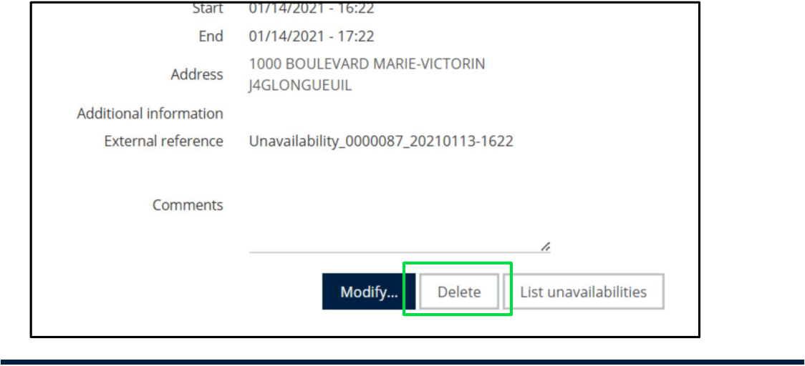

**NFS – Planning Module User Guide** 

**Confidential** 

Page **29** of **76** 

#### **6.3.5. Delete an Unavailability Occurrence** 

1. Click on **Planning** in the menu. 

2. Open the **Planning** Dropdown list 

3. Click on **Search for Unavailabilities** . 

4. Click **Find** 

5. Select an **Unavailable Resource** from the list. 

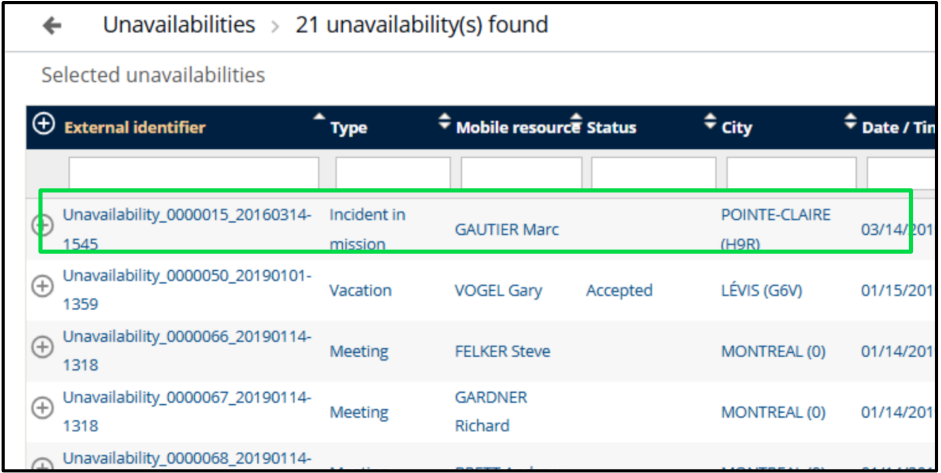

6. Click **Delete Occurrence** to remove the specific unavailability entry 

**Confidential** 

**NFS – Planning Module User Guide** 

Page **30** of **76** 

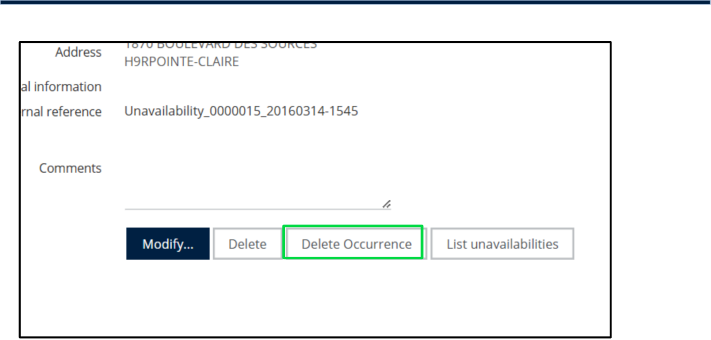

#### **6.3.6. List a Resource Unavailabilities** 

1. Click on **Planning** in the menu. 

2. Open the **Planning** Dropdown list 

3. Click on **Search for Unavailabilities** . 

4. Click **Find** 

5. Select an **Unavailable Resource** from the list. 

6. Click on the **List Unavailabilities** next to the Delete Occurrence tab below. 

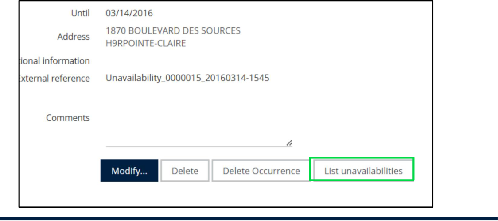

**NFS – Planning Module User Guide                                                                                                                                                                                Confidential** 

Page **31** of **76** 

#### **6.3.7. Change the status of Several Unavailabilities** 

1. Click on **Planning** in the menu. 

2. Open the **Planning** Dropdown list 

3. Click on **Search for Unavailabilities** . 

4. Click " **Find** " 

5. Select the **Desired Status** from the list. 

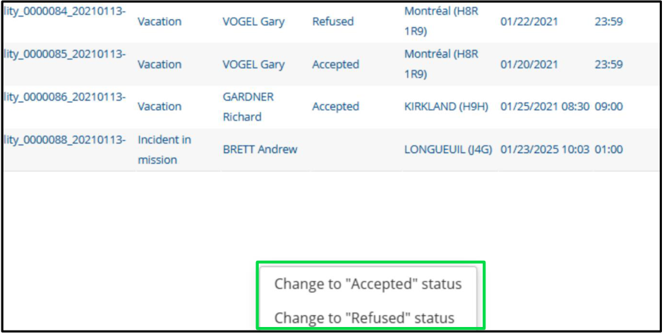

### **6.4. Manage Resource Planning** 

The Resource Planning feature in the Nomadia Field Service Planning Module provides a centralized platform for managing and optimizing the schedules of field resources, ensuring efficient task allocation and seamless coordination. 

#### **6.4.1. Manage the Agenda** 

The Manage the Agenda feature is designed to optimize the organization, visibility, and management of schedules for field operations. By offering a range of customizable options, it ensures schedules are aligned with the operational priorities. 

##### **6.4.1.1. Understanding the Agenda Legend** 

The Agenda Legend serves as a visual guide, helping you decode the symbols, colors, and 

**Confidential** 

**NFS – Planning Module User Guide** 

Page **32** of **76** 

labels within the agenda or planning schedule. It enables quick interpretation of resource statuses, appointments, and tasks, enhancing scheduling efficiency. 

|**Feature**|**Description**|
|---|---|
|Color Codes|Different colors represent task priorities, making it easy to distinguish between tasks of varying importance.|
|Icons|Specific icons indicate the type of action required or the resource involved (e.g., technician, equipment).|
|Labels|Clear labels provide additional context or details about appointments and tasks.|

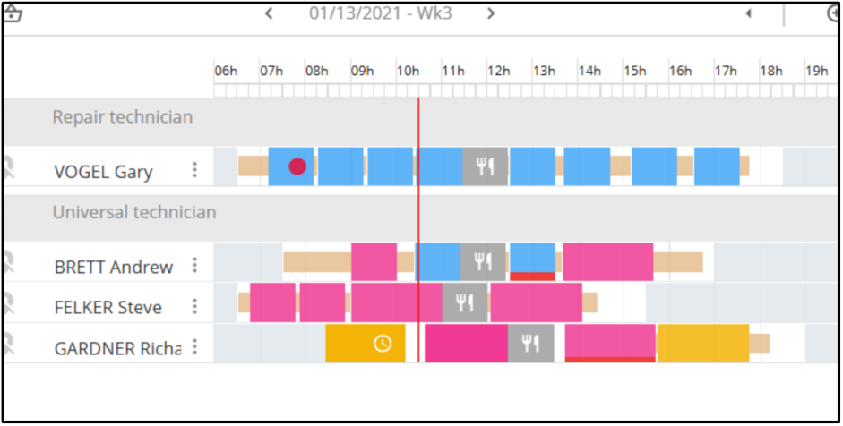

##### **6.4.1.2. Show / Hide the Agenda Legend** 

From the **Planning View** , 

- Hover over the **Icon** below. 

**Confidential** 

**NFS – Planning Module User Guide** 

Page **33** of **76** 

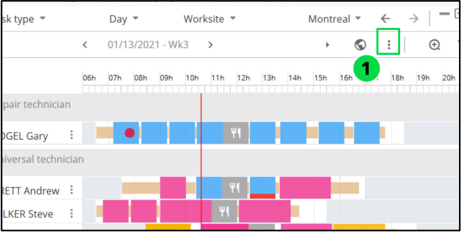

- Click on the **Legend** 

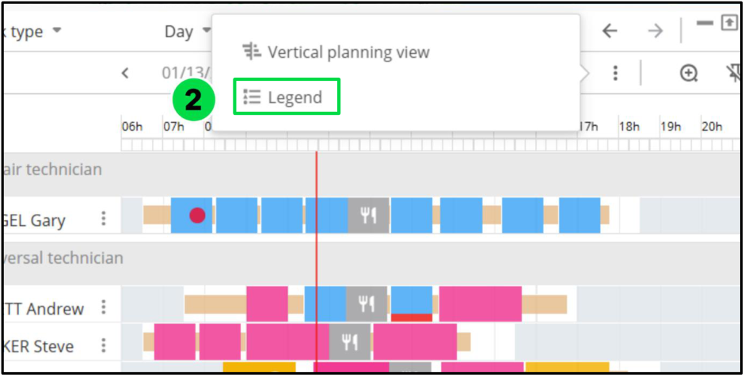

##### **6.4.1.3. Freezing the Agenda** 

From the **Planning View** , 

1. Click on the **Designated Icon** to activate or deactivate the 

- Schedule Freeze. 

**NFS – Planning Module User Guide** 

**Confidential** 

Page **34** of **76** 

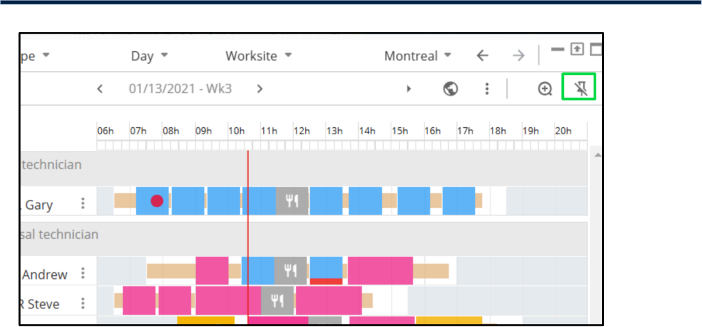

##### **6.4.1.4. Manage Agenda Marker** 

1. Click on **Planning** in the menu. 

2. Open the **Planning** Dropdown list 

3. Select **Agenda Marker** . 

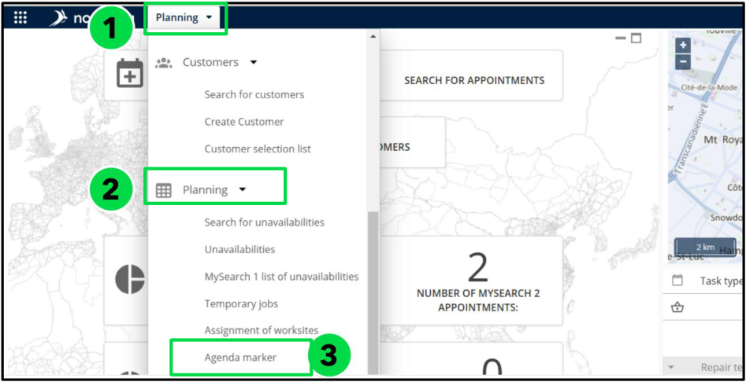

**Confidential** 

**NFS – Planning Module User Guide** 

Page **35** of **76** 

4. Fill in the following details: 

   **1. Name** 

   **2. Mobile Resource** 

###### **3. Work Site** 

###### **4. Type** 

   **5. Date (From and to)** 

5. Click **Add an Agenda Marker** 

_6._ Click **Search** 

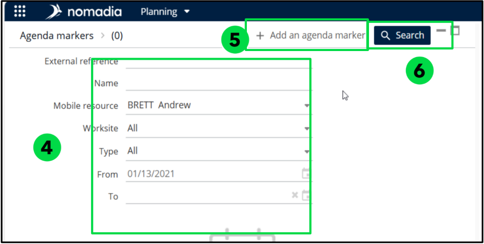

#### **6.4.2. Display the Location of the Resources Vehicles** 

1. Click on **Planning** in the menu. 

2. Open the **Location** Dropdown list 

3. Select **Vehicle Tracking** . 

**Confidential** 

**NFS – Planning Module User Guide** 

Page **36** of **76** 

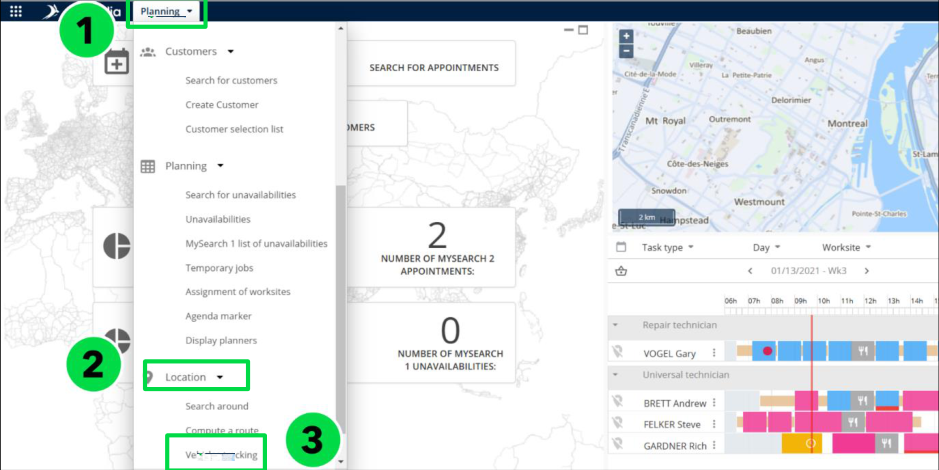

4. View the **Resource Vehicle** details displayed below. 

5. Click the **Designated Icon** to display the current positions of all resources on the map. 

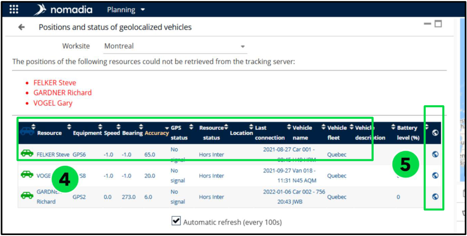

**Confidential** 

**NFS – Planning Module User Guide** 

Page **37** of **76** 

