# Nomadia Field Service

## **7. Manage Customers** 

The Manage Customers feature provides a centralized and efficient solution for organizing and maintaining customer information within the Nomadia Field Service system. It allows for easy creation, updating, and searching of customer profiles, ensuring accurate and upto-date data. 

### **7.1. Create a New Customer** 

1. Click on **Planning** in the menu. 

2. Open the **Customers** Dropdown list 

3. Select **Create Customer** . 

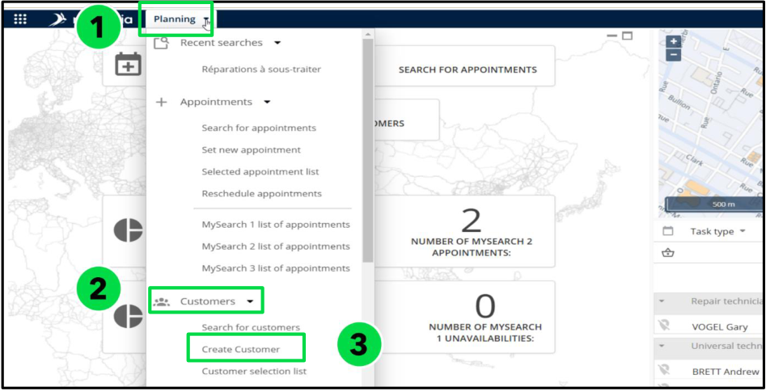

4. Enter the following details: 

**1. Customer Name** 

**Confidential** 

**NFS – Planning Module User Guide** 

Page **38** of **76** 

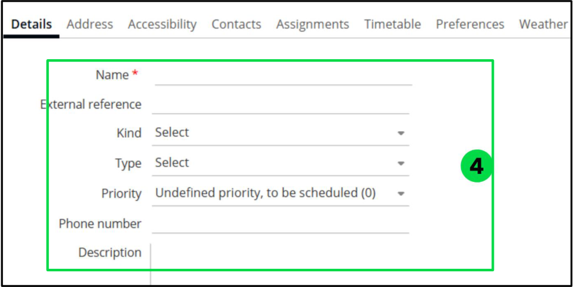

###### **2. Customer Address** 

   **3. Postcode or City** 

5. Click **Validate Address** . 

###### 6. Click **Save** . 

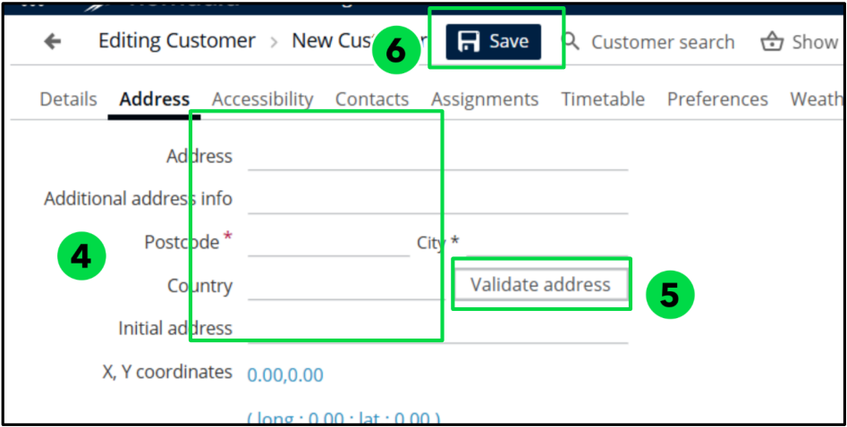

**NFS – Planning Module User Guide** 

**Confidential** 

Page **39** of **76** 

### **7.2. Edit a customer** 

- ✓ Click on **Planning** in the menu 

- ✓ Click **Search for Customers** . 

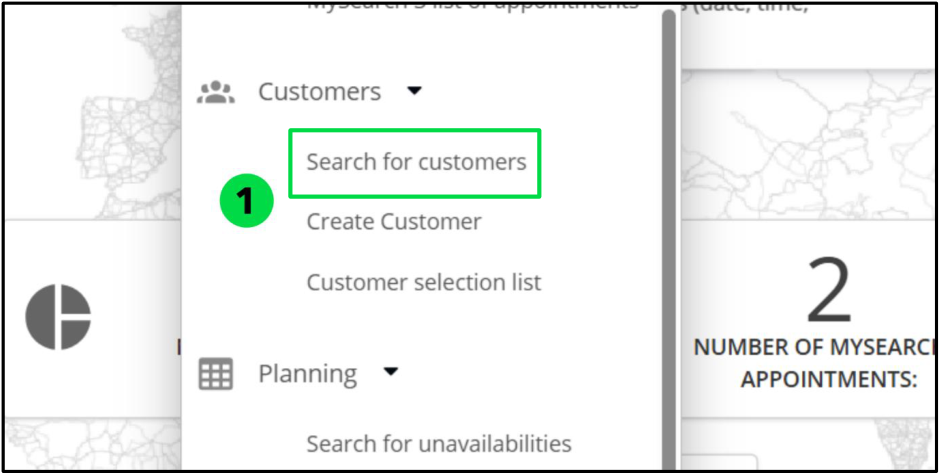

###### ✓ Click **Search** 

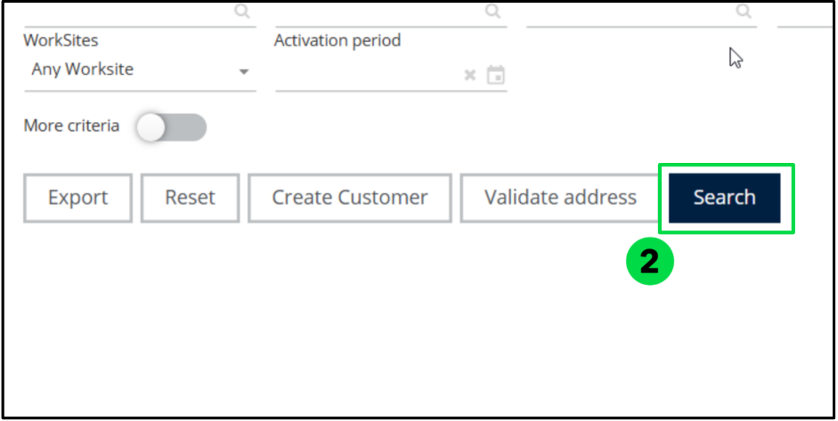

###### ✓ Select the **Desired Customer Name** . 

**NFS – Planning Module User Guide** 

**Confidential** 

Page **40** of **76** 

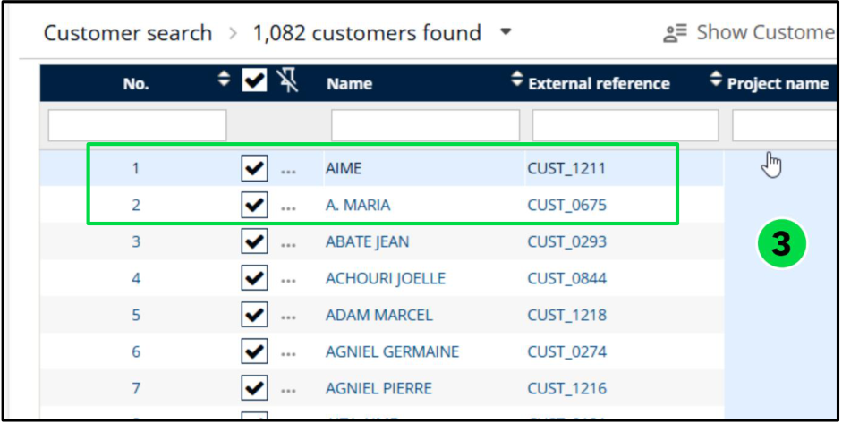

- ✓ A window will open, allowing you to edit the customer details. 

- ✓ Click **Save** . 

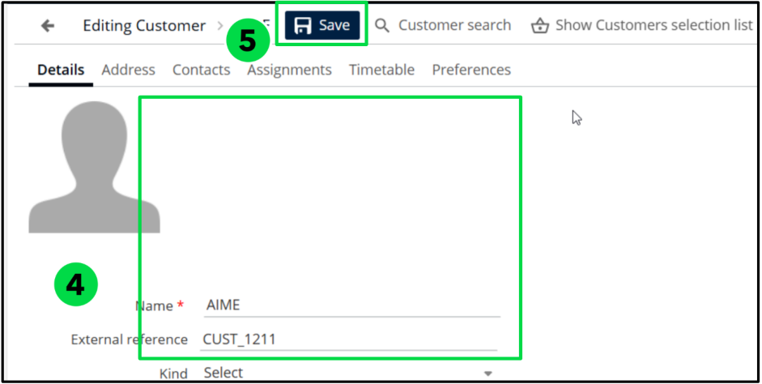

**Confidential** 

**NFS – Planning Module User Guide** 

Page **41** of **76** 

### **7.3. Manage Customer Contacts** 

The Manage Customer Contacts feature in the Nomadia Field Service Planning Module streamlines the organization and maintenance of customer relationships by enabling easy management of contact details. It ensures that customer information remains accurate and up to date. 

|**Feature**|**Description**|
|---|---|
|Add Contact|Create new customer contact entries with essential details.|
|Edit Contact|Update existing contact information as needed.|
|Search Contacts|Quickly locate customer contacts using filters and keywords.|

#### **7.3.1. Create a Contact** 

1. Click on **Planning** in the menu. 

2. Open the **Customers** Dropdown list 

3. Select **Search for Customers** . 

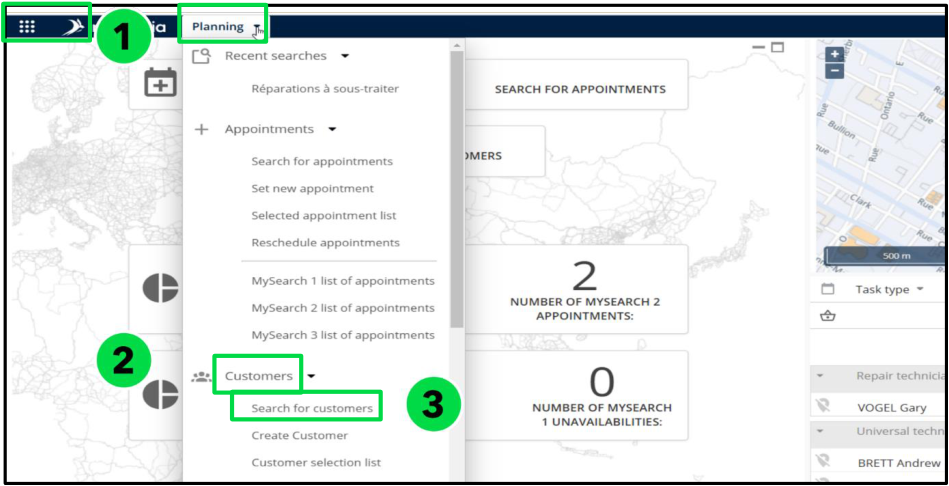

**Confidential** 

**NFS – Planning Module User Guide** 

Page **42** of **76** 

4. Select the customer whose details you want to update. 

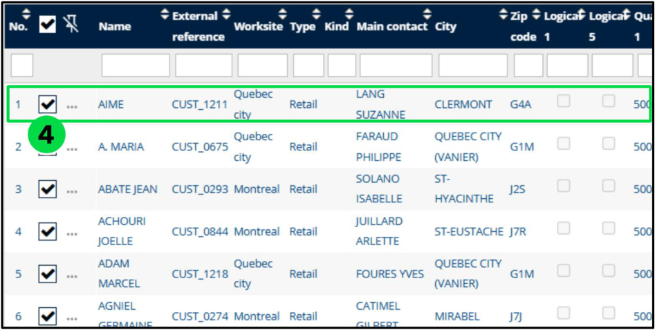

5. Go to the **Contacts** Section 

6. Click on **Add a Contact** 

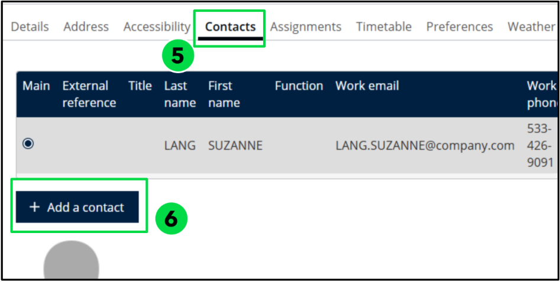

**Confidential** 

**NFS – Planning Module User Guide** 

Page **43** of **76** 

#### **7.3.2. Edit a Contact** 

1. Click on **Planning** in the menu. 

2. Open the **Customers** Dropdown list 

3. Select **Search for Customers** . 

4. Select the customer whose details you want to update 

5. Go to the **Contacts** Section 

6. Click on a **Contact** to modify or edit its details 

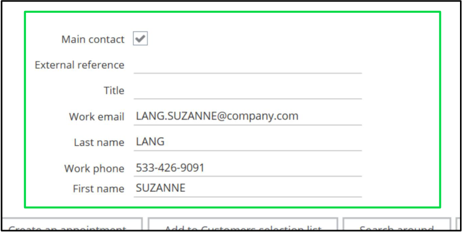

#### **7.3.3. Delete a Contact** 

1. Click on **Planning** in the menu. 

2. Open the **Customers** Dropdown list 

3. Select **Search for Customers** . 

4. Select the customer whose details you want to update 

5. Go to the **Contacts** Section 

6. Click on a **Contact** 

7. Click on **Delete** to remove the contact. 

**Confidential** 

**NFS – Planning Module User Guide** 

Page **44** of **76** 

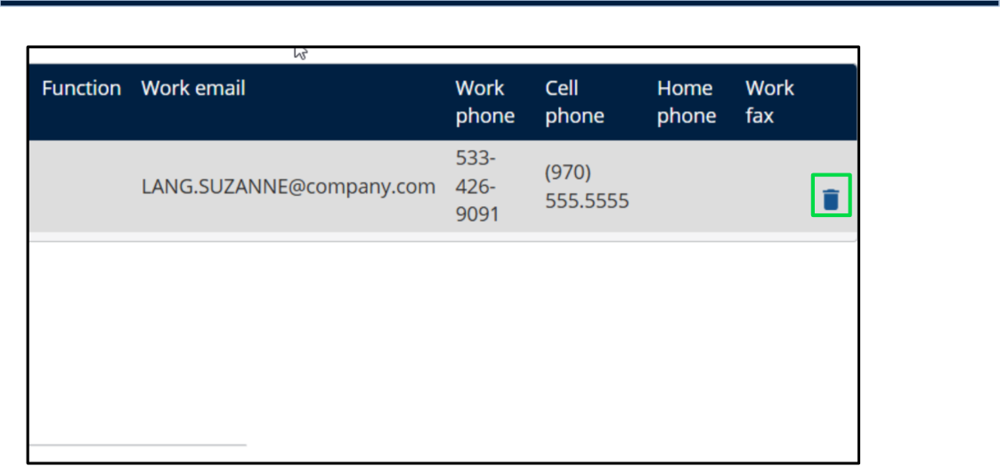

### **7.4. Manage Opening Hours** 

The Manage Opening Hours feature allows you to configure and customize business or service operation hours. You can set time zones, define opening and closing times, and adjust schedules as needed. 

|**Feature**|**Description**|
|---|---|
|Set Working Hours|Define daily opening and closing times.|
|Configure Time Zones|Adjust time settings based on location.|
|Modify Schedules|Update hours based on operational needs.|
|Apply Changes|Save and implement schedule adjustments.|

**Confidential** 

**NFS – Planning Module User Guide** 

Page **45** of **76** 

#### **7.4.1. Edit Opening Hours** 

1. Click on **Planning** in the menu. 

2. Open the **Customers** Dropdown list 

3. Select **Search for Customers** . 

4. Select the customer whose details you want to update 

5. Navigate to the **Timetable section** 

6. Select the **Time Zone** and adjust the **Opening Hours** as needed. 

7. Click **Save** 

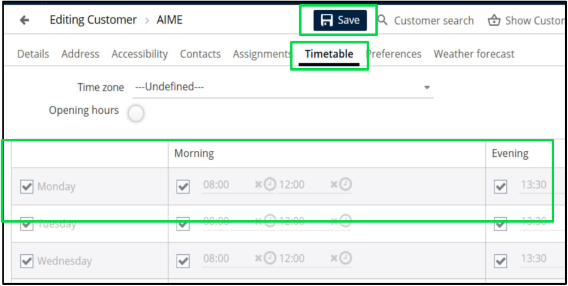

#### **7.4.2. Add Closing Periods** 

1. Click on **Planning** in the menu. 

2. Open the **Customers** Dropdown list 

3. Select **Search for Customers** . 

4. Select the customer whose details you want to update 

5. Navigate to the **Timetable section** 

6. Choose the **Time Zone** and modify the **Closing Hours** as necessary. 

**Confidential** 

**NFS – Planning Module User Guide** 

Page **46** of **76** 

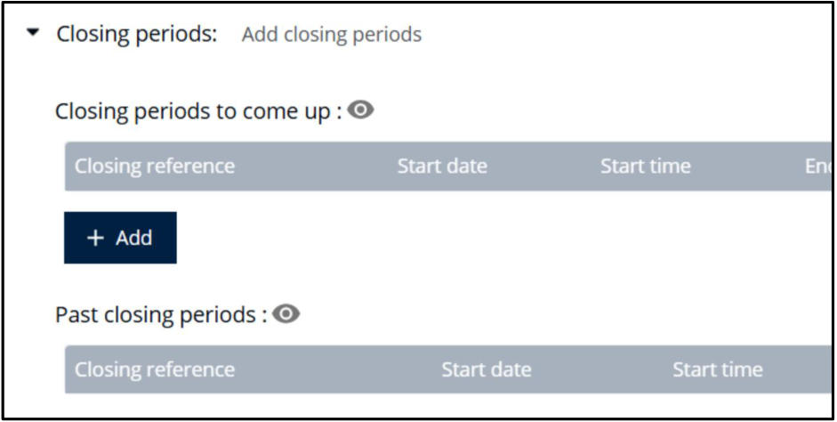

### **7.5. Display a Customer Planning** 

1. Click on **Search for Customers** . 

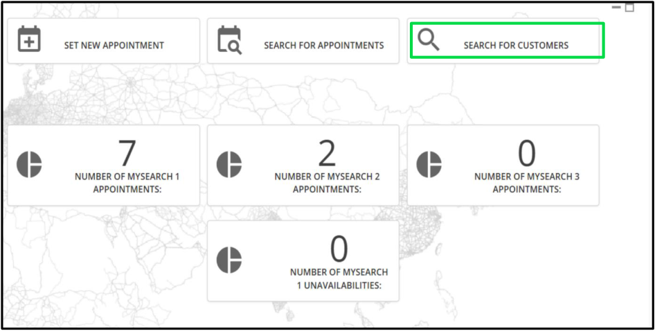

2. Enter the **Customer's Name** in the search field. 

3. Click on **Search** to display the results. 

4. From the list, click on the **Desired Customer's Name** . 

**Confidential** 

**NFS – Planning Module User Guide** 

Page **47** of **76** 

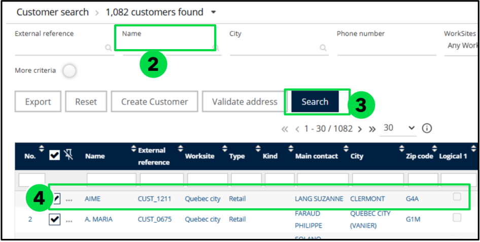

###### 5. Choose between **Month planning** or **Week planning** . 

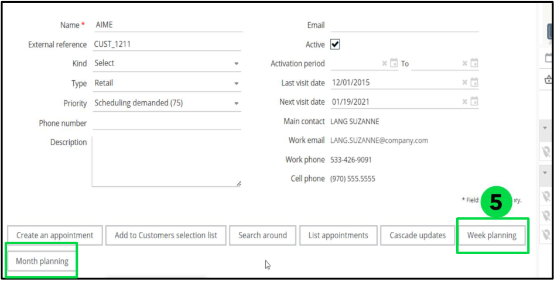

**Confidential** 

**NFS – Planning Module User Guide** 

Page **48** of **76** 

### **7.6. Add a Picture to a Customer** 

1. Click on **Planning** in the menu. 

2. Open the **Customers** Dropdown list 

3. Click on **Search for Customers** . 

4. Select the customer whose details you want to update 

5. Click on the **Details Option.** 

6. Click on the **Picture Icon** below to browse and upload an **Image** from your **Local** 

###### **Device** 

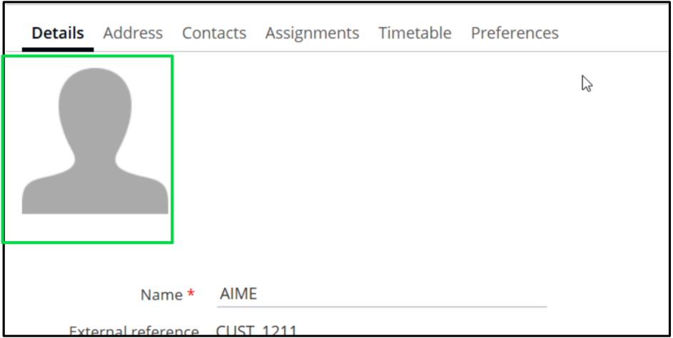

### **7.7. Attach a Document to a Customer** 

1. Click on **Planning** in the menu. 

2. Open the **Customers** Dropdown list 

3. Click on **Search for Customers** . 

4. Select the customer whose details you want to update 

5. Click on **Preferences** . 

6. Click on **Add a Document** 

**Confidential** 

**NFS – Planning Module User Guide** 

Page **49** of **76** 

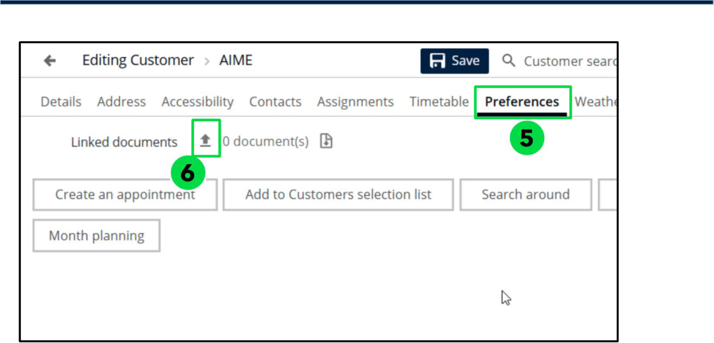

### **7.8. Search for a Customer** 

1. Click on **Planning** in the menu. 

2. Open the **Customers** Dropdown list 

3. Click on **Search for Customer** . 

4. Enter the **Customer Name** and **City** in the fields provided. 

5. Click **Search** 

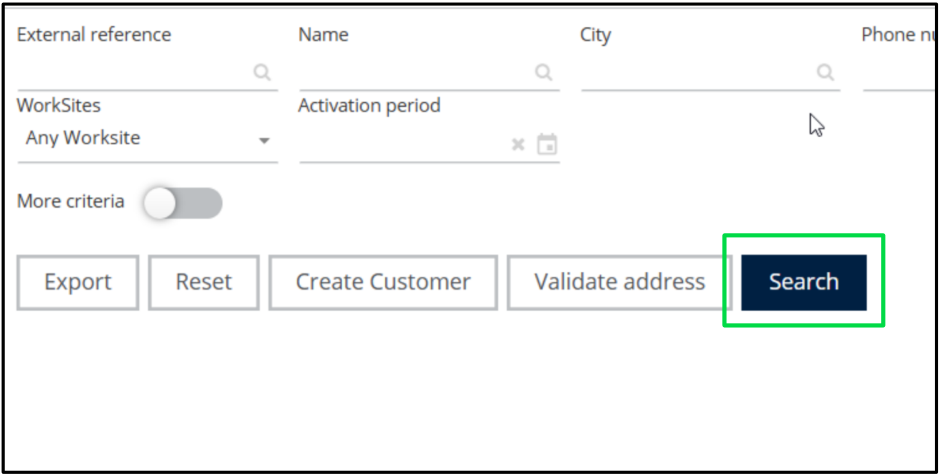

**NFS – Planning Module User Guide** 

**Confidential** 

Page **50** of **76** 

### **7.9. Search for a Customer on the Map** 

1. Click on **Planning** in the menu. 

2. Open the **Customers** Dropdown list 

3. Click on **Search for Customers** . 

4. Select the Customer from the list 

5. Click the **Icon** below to locate the **Customer** on the map. 

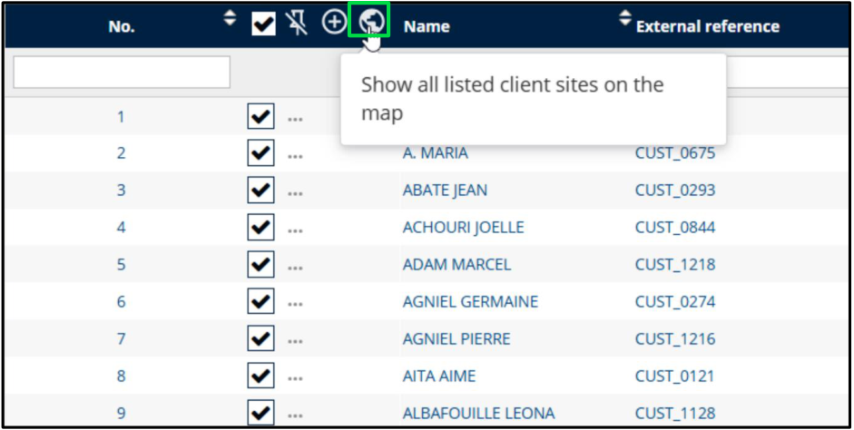

### **7.10. Edit Several Customers** 

The Edit Several Customers feature in the Nomadia Field Service Planning Module allows for efficient updates across multiple customer profiles at once. It enables the modification of key details, including last visit dates, next scheduled visits, worksite assignments, customer types, and other relevant fields. 

From the Wallpaper view: 

1. Click on **Search for Customers** 

2. Select **Show Customer Selection List** and follow the steps below 

**Confidential** 

**NFS – Planning Module User Guide** 

Page **51** of **76** 

#### **7.10.1. Select Customers** 

1. Click on **Planning** in the menu. 

2. Open the **Customers** Dropdown list 

3. Click on **Search for Customers** . 

4. Select a **customer** by clicking the icon below. 

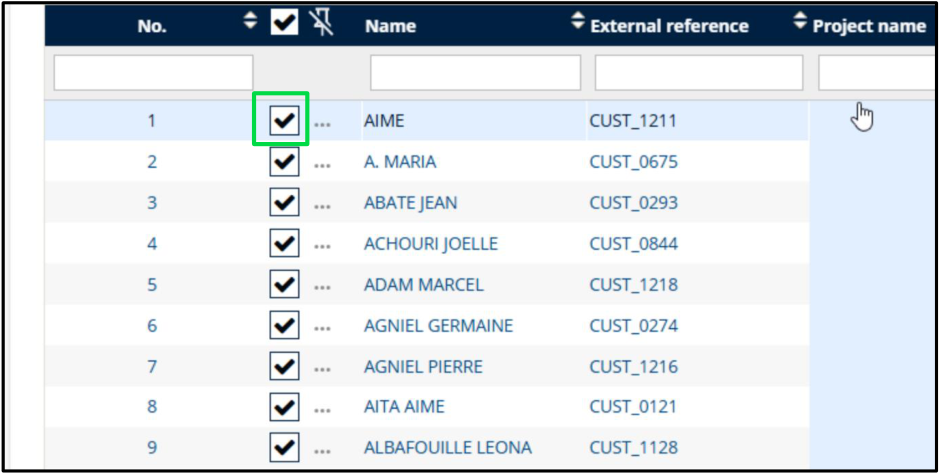

#### **7.10.2. Change the Last Visit Dates** 

1. Click on **Planning** in the menu. 

2. Open the **Customers** Dropdown list 

3. Click on **Search for Customers** . 

4. Click on **Show Customers Selection List** 

5. Select the Customer from the list 

6. Change the **Last Visit Date** by clicking the icon below 

**Confidential** 

**NFS – Planning Module User Guide** 

Page **52** of **76** 

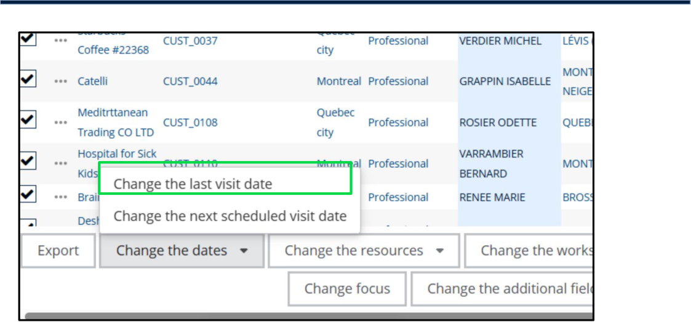

#### **7.10.3. Change the Next Scheduled Visit Date** 

1. Click on **Planning** in the menu. 

2. Open the **Customers** Dropdown list 

3. Click on **Search for Customers** . 

4. Click on **Show Customers Selection List** 

5. Select the Customer from the list. 

6. Change the **Next Schedule Visit Date** by clicking the icon below 

**Confidential** 

**NFS – Planning Module User Guide** 

Page **53** of **76** 

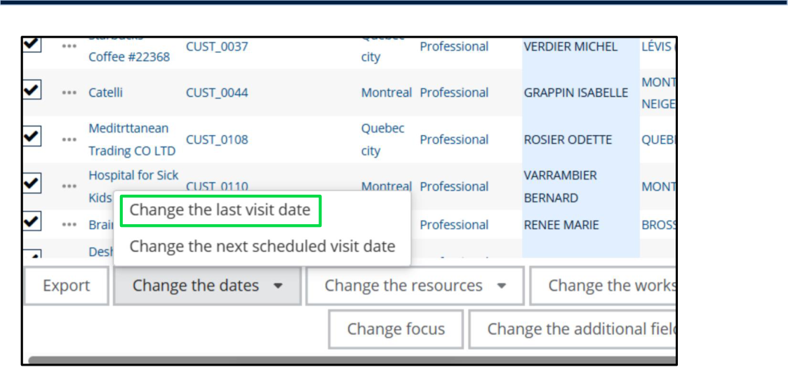

#### **7.10.4. Change the Worksite** 

1. Click on **Planning** in the menu. 

2. Open the **Customers** Dropdown list 

3. Click on **Search for Customers** . 

4. Click on **Show Customers Selection List** 

5. Select the Customer from the list 

6. Change the **Worksite** by clicking the icon below 

**Confidential** 

**NFS – Planning Module User Guide** 

Page **54** of **76** 

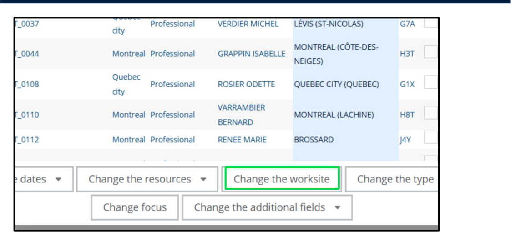

#### **7.10.5. Change the Type** 

1. Click on **Planning** in the menu. 

2. Open the **Customers** Dropdown list 

3. Click on **Search for Customers** . 

4. Click on **Show Customers Selection List** 

5. Select the Customer from the list 

6. Change the **Type** by clicking the icon below. 

**Confidential** 

**NFS – Planning Module User Guide** 

Page **55** of **76** 

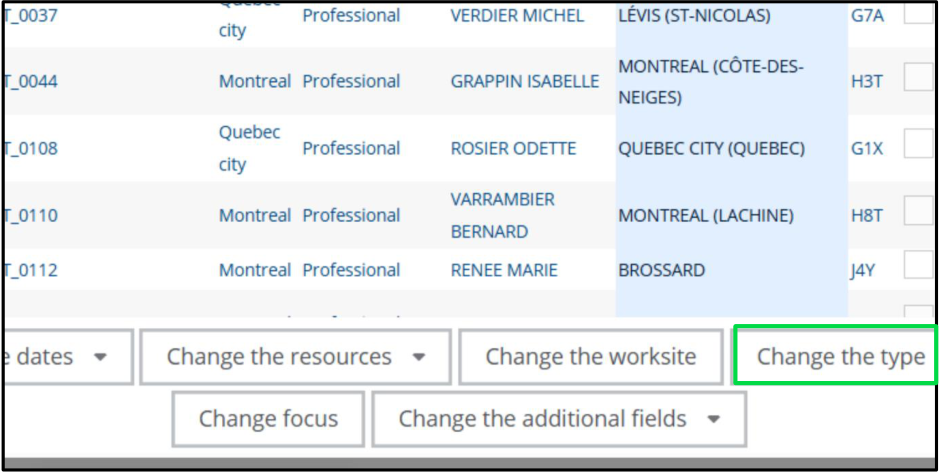

#### **7.10.6. Change the Kind** 

1. Click on **Planning** in the menu. 

2. Open the **Customers** Dropdown list 

3. Click on **Search for Customers** . 

4. Click on **Show Customers Selection List** 

5. Select the Customer from the list 

6. Change the **Kind** by clicking the icon below 

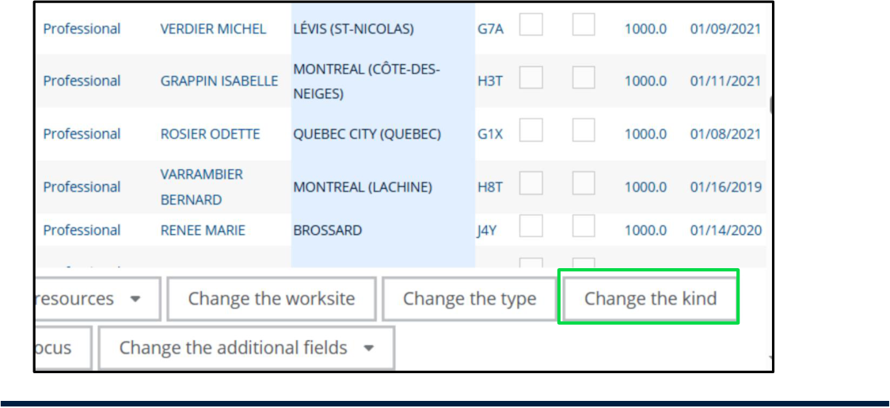

**NFS – Planning Module User Guide** 

**Confidential** 

Page **56** of **76** 

#### **7.10.7. Change Focus** 

1. Click on **Planning** in the menu. 

2. Open the **Customers** Dropdown list 

3. Click on **Search for Customers** . 

4. Click on **Show Customers Selection List** 

5. Select the Customer from the list 

6. Change the **Focus** by clicking the icon below 

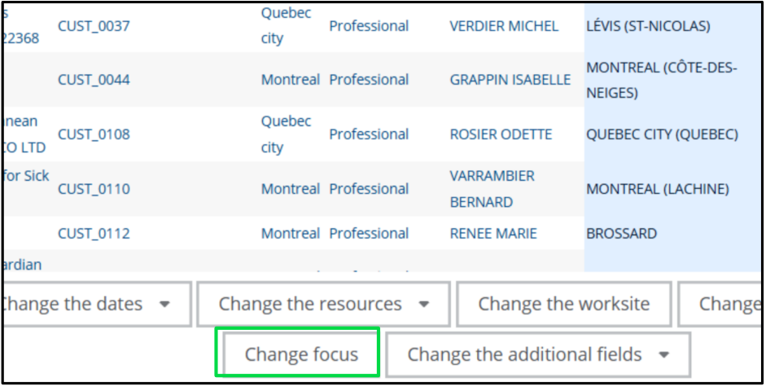

#### **7.10.8. Change the Additional Fields** 

1. Click on **Planning** in the menu. 

2. Open the **Customers** Dropdown list 

3. Click on **Search for Customers** . 

4. Click on **Show Customers Selection List** 

5. Select the Customer from the list 

6. Change the **Additional Fields** by clicking the icon below 

**Confidential** 

**NFS – Planning Module User Guide** 

Page **57** of **76** 

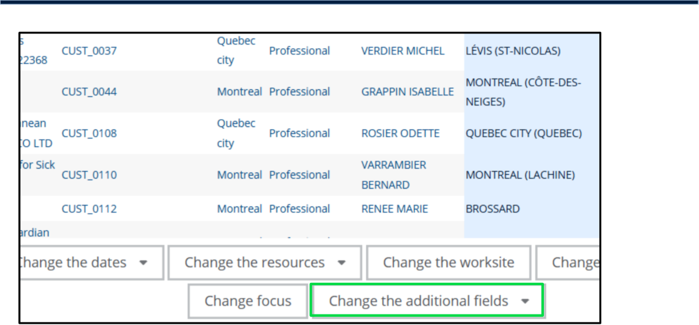

### **7.11. Export a Customer List** 

1. Click on **Planning** in the menu. 

2. Open the **Customers** Dropdown list 

3. Click on **Search for Customers** . 

4. Click on **Show Customers Selection List** 

5. Select the Customer from the list 

6. Export a **Customer List** by clicking the icon below 

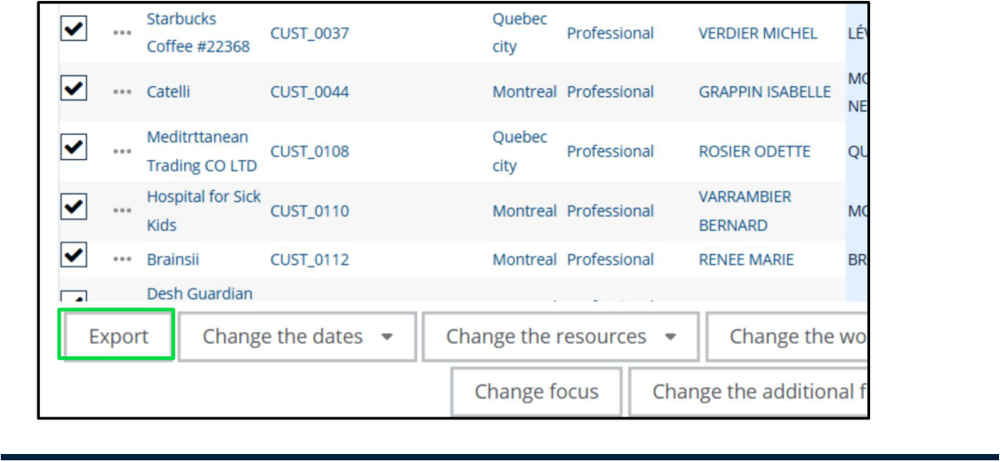

**NFS – Planning Module User Guide** 

**Confidential** 

Page **58** of **76** 

