# Nomadia Field Service

## **8. Manage Appointments** 

The Manage Appointments provides an intuitive interface for handling customer appointments efficiently. It allows you to search, view, create, and update appointments, ensuring smooth scheduling and organization. 

|**Feature**|**Description**|
|---|---|
|Create Appointment|Schedule new customer appointments.|
|Edit Appointment|Update appointment details as needed.|
|Search Appointments|Quickly find appointments using filters.|
|View Schedule|Access and manage all scheduled appointments.|

### **8.1. Manage Searches** 

The Manage Searches feature enables you to filter and locate customer appointments efficiently, streamlining your workflow and saving time. 

|**Feature**|**Description**|
|---|---|
|Search Filters|Apply filters such as type, date range, and priority to narrow down results.|
|Date Range|Select a specific period to view relevant appointments.|
|Priority|Focus on high, medium, or low-priority customer appointments.|

### **8.1.1 Search for an Appointment** 

From the **Wallpaper view** 

1. Click on **Search for Appointments** . 

**Confidential** 

**NFS – Planning Module User Guide** 

Page **59** of **76** 

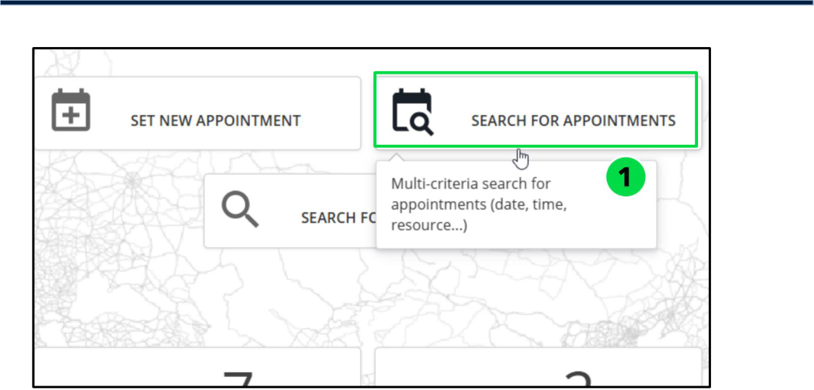

2. Enter the Desired Search Criteria or click **Find** to display the **Appointments found** 

**Note** : If no appointments match the search criteria, the list will remain empty. 

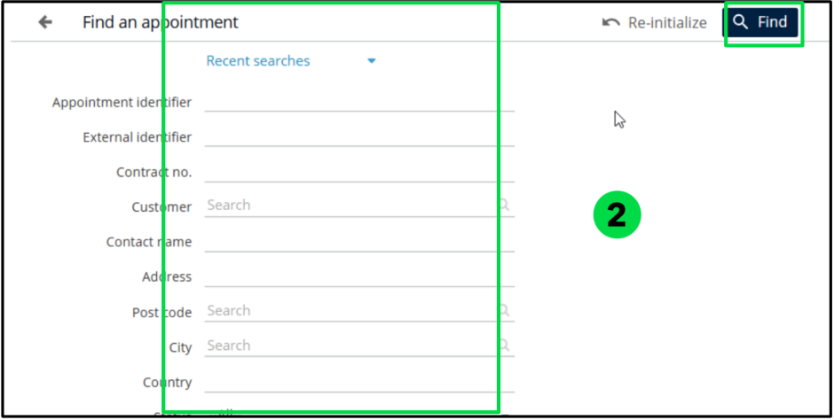

#### **8.1.2. Display Recent Searches** 

From the **Wallpaper View** 

- Select **Search for Appointments** . 

**NFS – Planning Module User Guide** 

**Confidential** 

Page **60** of **76** 

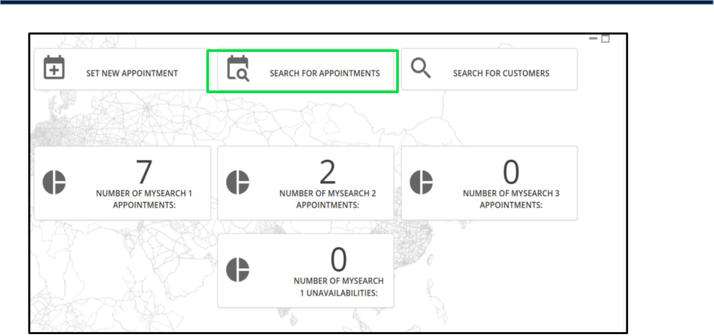

- Go to **Recent Searches** , then choose the “ **From** and **To”** dates along with the **Status** . 

- Click **Find** 

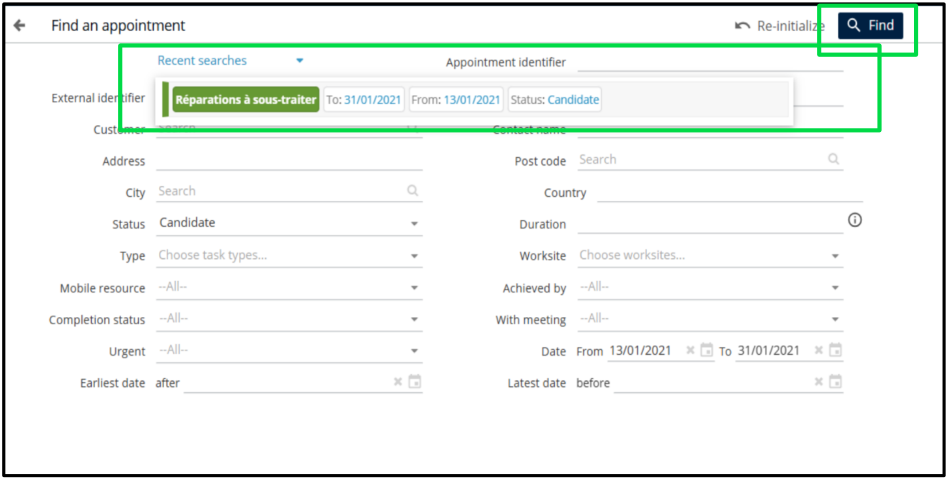

### **8.2. Schedule for a New Appointment** 

From the **Wallpaper view** 

###### 1. Select **Set New Appointment** . 

**Confidential** 

**NFS – Planning Module User Guide** 

Page **61** of **76** 

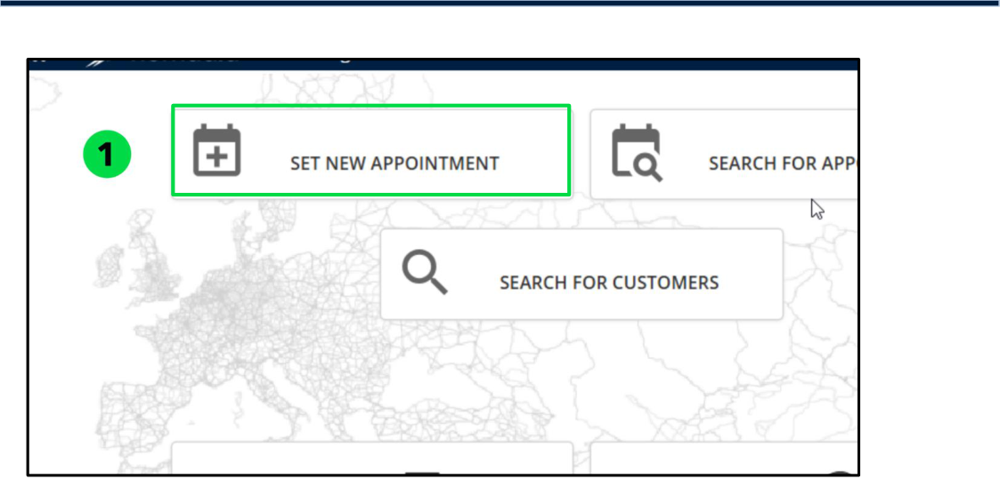

###### 2. Choose the **Customer's Name** from the list. 

###### 3. Click **Continue** . 

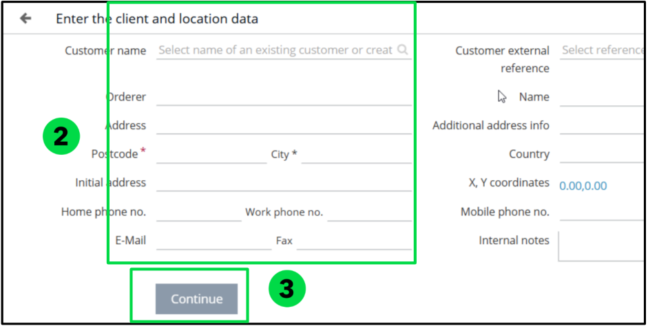

4. Select one or more **Types of Intervention** . 

5. Modify the **Intervention Details** if needed. 

6. Choose an **Operation Type** to schedule the appointment. 

**Confidential** 

**NFS – Planning Module User Guide** 

Page **62** of **76** 

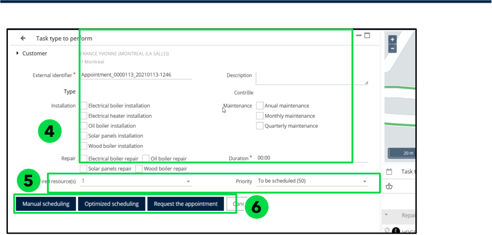

**Note** : If the operation type is set to **'Plan'** or **'Manual Scheduling’** , a time slot table may be suggested 

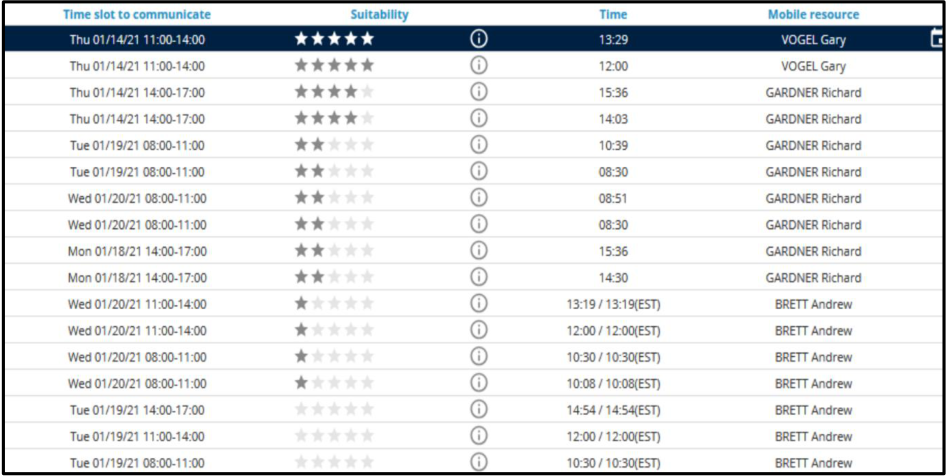

###### 7. Click **Request an Appointment** 

**Confidential** 

**NFS – Planning Module User Guide** 

Page **63** of **76** 

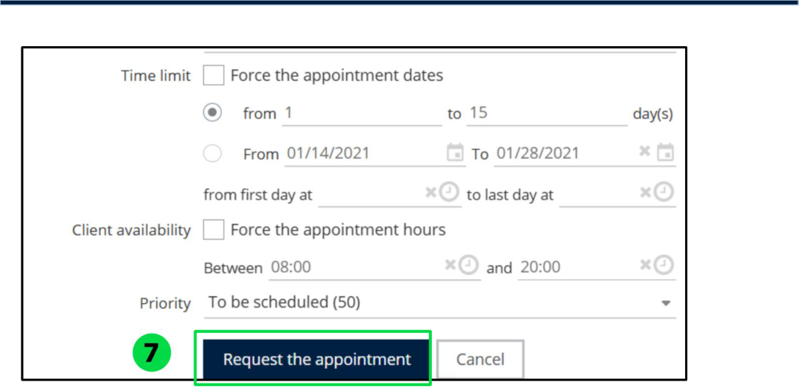

### **8.3. Display Appointments for a Customer** 

1. Click on **Planning** in the menu. 

2. Open the **Customers** dropdown list. 

3. Click on **Search for Customers** . 

4. Select a customer and click on their name. 

5. Click on **List Appointments** to display the **list of appointments of a client site** . 

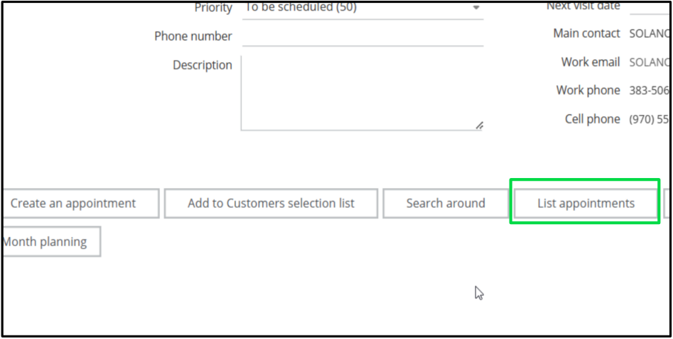

**NFS – Planning Module User Guide** 

**Confidential** 

Page **64** of **76** 

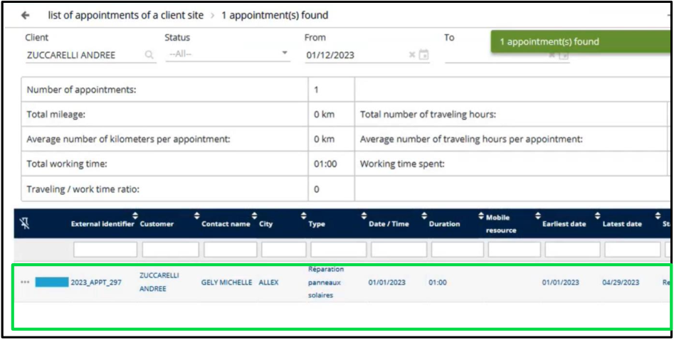

### **8.4. Add an Appointment** 

The Add an Appointment feature simplifies the process of scheduling and managing customer appointments. This functionality allows you to search for available time slots, select customer details, and quickly add them to the planning panel. 

#### **8.4.1. Add an Appointment to the Appointment Panel** 

From the **Appointments Found List** <u>(Refer to Section 8.1.1)</u> or the **List of Appointments** 

**for a client site** <u>(Refer to Section 8.3).</u> 

1. Click the **Panel** icon on the selected appointment line. 

**Confidential** 

**NFS – Planning Module User Guide** 

Page **65** of **76** 

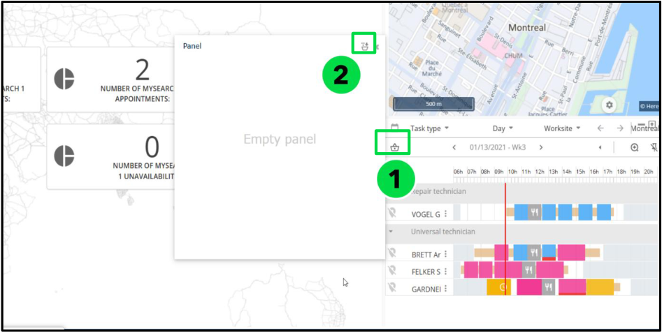

#### **8.4.2. Add an Appointment to the Selection List** 

From the **Appointments Found List** <u>(Refer to Section 8.1.1)</u> or the **List of Appointments for a client site** <u>(Refer to Section 8.3)</u> 

1. Click the **+** icon on the selected appointment line 

**Confidential** 

**NFS – Planning Module User Guide** 

Page **66** of **76** 

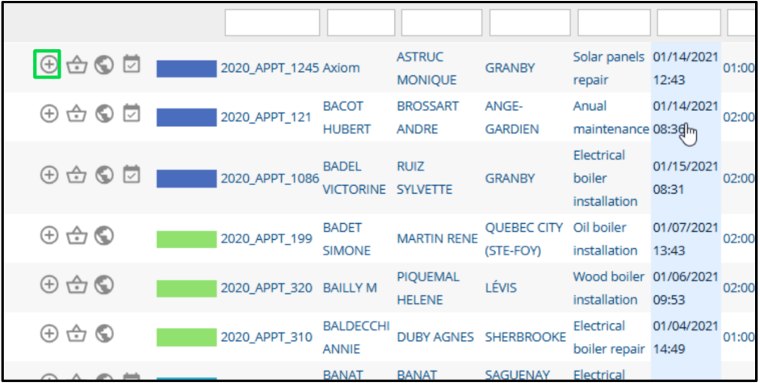

### **8.5. Edit an Appointment** 

1. Click on **Planning** in the menu. 

2. Open the **Customers** Dropdown list 

3. Click on **Search for Appointments** 

4. Click on **Find** 

5. Select the Appointment from the list 

6. Modify the information in the **Appointment form** . 

**Confidential** 

**NFS – Planning Module User Guide** 

Page **67** of **76** 

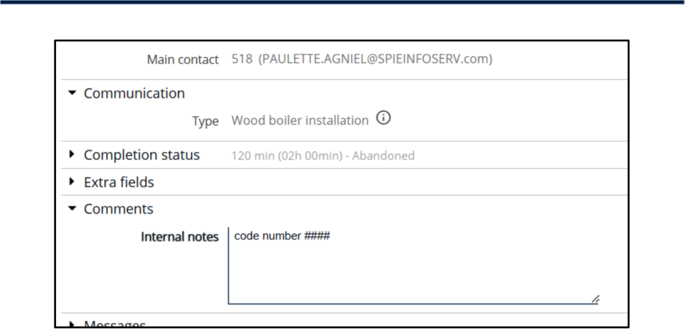

### **8.6. Manage the Panel** 

Below are the options available for managing appointments, along with their corresponding functionalities: 

- A. Add an Appointment from the **Appointment selection list** 

- B. Add an Appointment to the **Appointment selection list** 

- C. Empty the **Panel** 

- D. Show All Listed Client Sites on the Map 

- E. Plan the Panel Appointments 

- F. Change the **Grouping Criteria** 

**Confidential** 

**NFS – Planning Module User Guide** 

Page **68** of **76** 

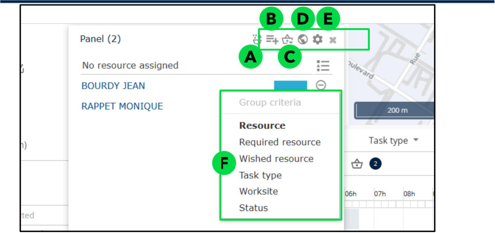

The available grouping options include: 

- **Resource** – Organizes appointments by assigned personnel. 

- **Required Resource** – Groups appointments based on mandatory personnel requirements. 

- **Wished Resource** – Displays preferred personnel for each appointment. 

- **Task Type** – Categorizes appointments based on the nature of the task. 

- **Worksite** – Groups appointments by their respective locations. 

- **Status** – Organizes appointments based on their status (e.g., pending, confirmed, completed). 

### **8.7. Locate an Appointment on the Map** 

1. Click on **Planning** in the menu. 

2. Open the **Customers** Dropdown list 

3. Click on **Search for Appointments** 

4. Click on **Find** 

5. Select the Appointment from the list 

6. Click the **Icon** below to view the appointments on the map. 

**Confidential** 

**NFS – Planning Module User Guide** 

Page **69** of **76** 

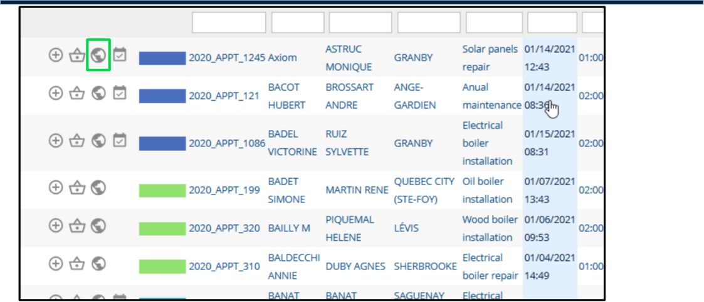
