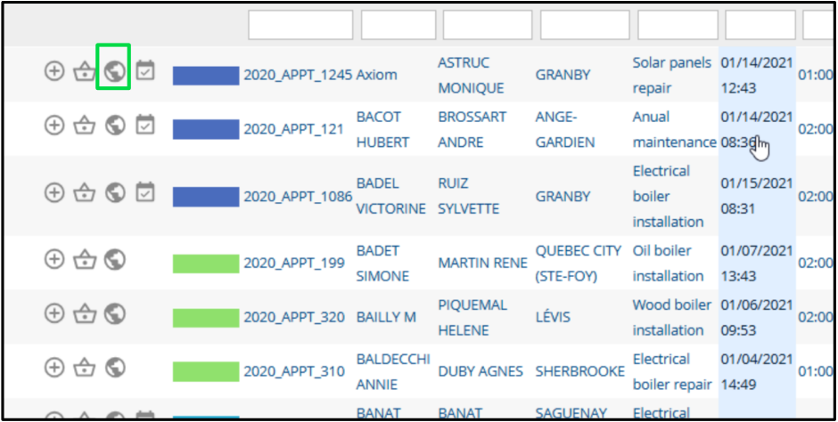
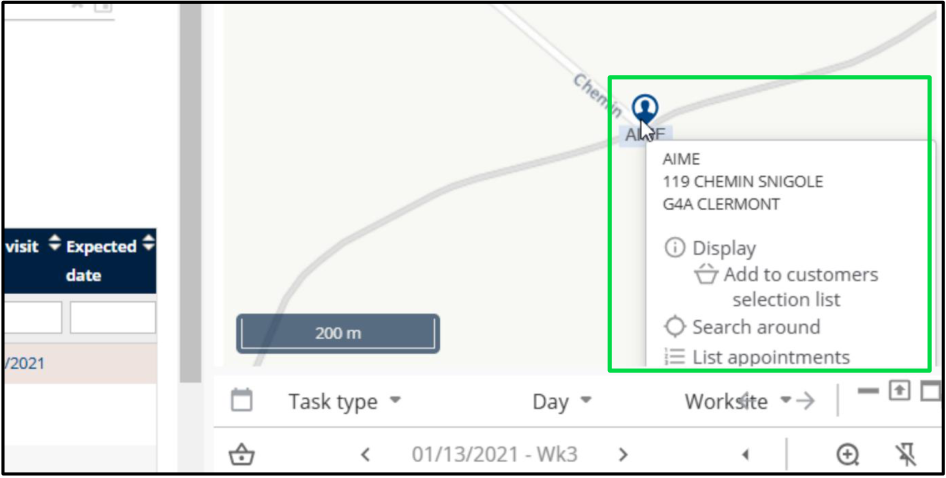
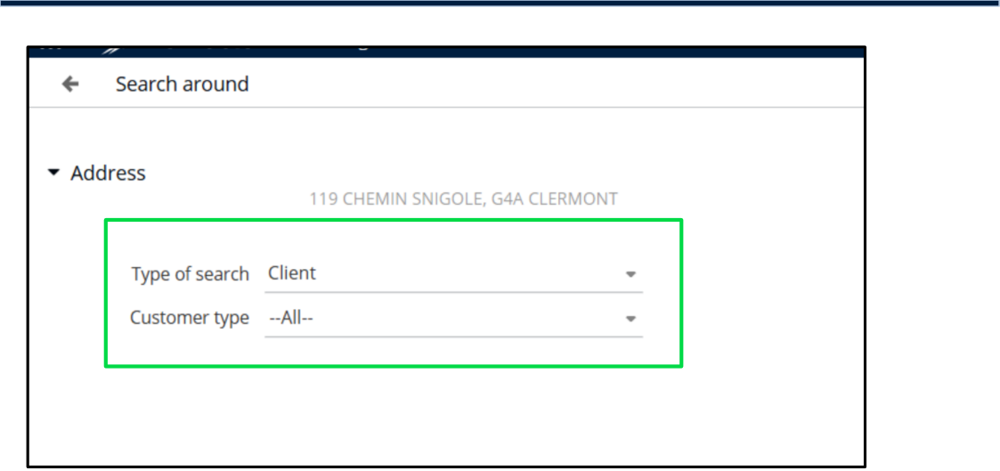

# Nomadia Field Service

## **9. Manage the Map** 

The Manage Map feature helps you efficiently search and navigate locations. You can use address search or interact directly with the map to find tasks, appointments, and points of interest. 

|**Feature**|**Description**|
|---|---|
|Search Location|Locate specific locations by entering an address|
|Navigate Map|Use the map interface to zoom in, pan, and navigate around areas of interest.|
|Locate Appointments|Define and search for tasks or locations within a specified geographic area.|
|Filter Results|View and navigate directly to task or appointment locations on the map.|

. 

### **9.1. Search around a Location** 

1. Click on **Planning** in the menu. 

2. Expand the Customers dropdown list. 

3. Click on **Search for Customers** . 

4. Select a customer by clicking the corresponding icon. 

**Confidential** 

**NFS – Planning Module User Guide** 

Page **70** of **76** 

5. Click the **Globe** icon to view the customer’s location on the map. 

6. On the map, click the **Location** icon to open the menu. 

7. Click on **Search Around** from the menu. 

8. Various search options will be available. 

9. Choose the option to display all appointments on the map. 

**Confidential** 

**NFS – Planning Module User Guide** 

Page **71** of **76** 

